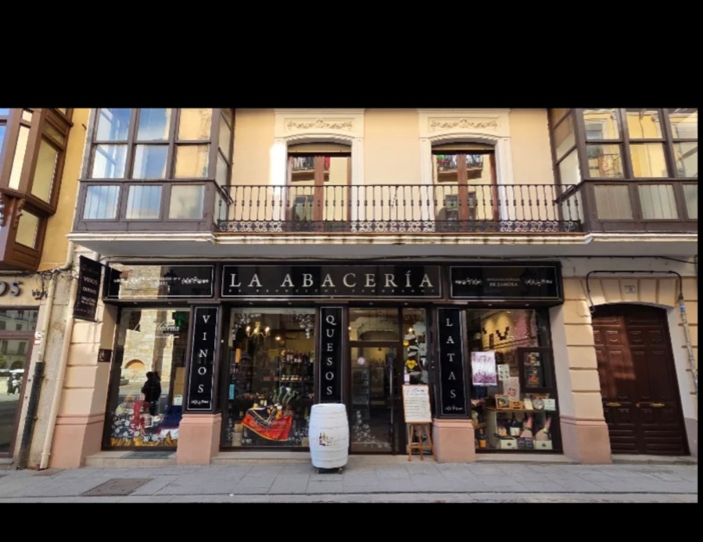

# Concepto de tienda — Showroom Villardeciervos


**Marketplace Villardeciervos – Sabores de la Culebra**

Concepto de punto físico: **híbrido “Abacería delante / logística detrás”**. Escaparate gourmet de confianza + centro de consolidación de pedidos + oficina técnica, en local en **comodato**.

**Referencias:** [`Dossier_Socios_Marketplace_Villardeciervos.md`](./Dossier_Socios_Marketplace_Villardeciervos.md) §14 · [`Argumentario_Captacion_Productores.md`](./Argumentario_Captacion_Productores.md) · [`Estrategia_Captacion_Productores.md`](./Estrategia_Captacion_Productores.md) · [`Resumen_Ejecutivo_Socios.md`](./Resumen_Ejecutivo_Socios.md) · Plan de viabilidad §6 (comodato)

---

## 1. Objetivo del local

El local de Villardeciervos cumple **tres funciones** a la vez:

| Función | Para quién | Qué aporta |
|---------|------------|------------|
| **Escaparate de confianza** | Visitante, turista, productor | Ver y tocar producto; prueba social; canal de captación |
| **Consolidación logística** | Pedidos online multiproductor | Un solo envío; picking; etiquetado de caja |
| **Oficina técnica** | Equipo S.L. | Admin, NAS, desarrollo, justificación de ayudas |

El showroom **no** es el negocio principal: es el **diferencial comercial** frente a marketplaces genéricos y el soporte físico de la estrategia de captación (prueba con poco stock).

Legalmente el espacio opera como **oficina y almacén de paquetería limpia** (distribuidores, no envasadores): no se abre ni manipula el alimento. Detalle: dossier §14.

---

## 2. Lecciones de La Abacería (referente)



**Fuente:** [La Abacería, el más bello escaparate de los productos gourmet de Zamora](https://hosteleriaenzamora.com/la-abaceria-el-mas-bello-escaparate-de-los-productos-gourmet-de-zamora/) (Hostelería en Zamora, Ana Pedrero). Ubicación: Ramos Carrión 9, casco antiguo de Zamora.

| Tomar | Adaptar | Evitar |
|-------|---------|--------|
| Fachada leíble a 10 m: nombre + tipografía + categorías verticales | Categorías del **piloto Culebra** (miel, embutido, legumbres…), no catálogo provincial entero | Copiar el modelo de tienda urbana de alto tráfico peatonal |
| Escaparate como “vitrina de territorio”, producto curado | Foco **Sierra de la Culebra / La Raya / comarca** | Posicionarse como “todo Zamora” frente a La Abacería |
| Puesta en escena mimada (madera, luz cálida, densidad controlada) | Escala rural y presupuesto de obra menor | Obra sanitaria tipo obrador / APPCC de manipulación |
| Experiencia: ver, preguntar, probar; trato humano | Horarios **estacionales** (Socio 2); degustación puntual | Local 100 % retail sin trastienda logística |
| Rotación estacional / piezas de identidad | Lobo, miel, embutido, legumbres, paisaje | Invertir en stock propio o compra de género |

**Mensaje para socios y productores:** mismo mimo de escaparate que una buena abacería zamorana; **distinto modelo** (marketplace + consolidación rural, sin comprar stock).

---

## 3. Identidad visual del punto físico

### Paleta orientativa

| Elemento | Dirección |
|----------|-----------|
| Estructura / fondo | Piedra o enlucido neutro del edificio (no pintar “de marca” toda la fachada) |
| Señalética | **Negro** mate (franjas / paneles) + tipografía **blanca** |
| Interior | Madera clara/media, luz cálida, estanterías abiertas |
| Acentos | Producto real (etiquetas, vidrio, latas); evitar crema + terracota genérico de “rural AI” |

### Tipografía de rótulo

- Nombre principal: **SABORES DE LA CULEBRA** (o marca comercial definitiva), serif o display legible a distancia.
- Subtítulo: producto local / Villardeciervos / Sierra de la Culebra.
- Evitar tipografías genéricas de sistema en el rótulo físico.

### Categorías verticales (piloto)

Adaptación del recurso Abacería (VINOS / QUESOS / LATAS). Propuesta para arranque:

| Panel | Categoría |
|-------|-----------|
| 1 | **MIEL** |
| 2 | **EMBUTIDO** |
| 3 | **LEGUMBRES** |
| 4 | **QUESOS** *(si hay productor piloto)* |
| 5 | **CONSERVAS** |
| 6 | **VINOS** *(si hay productor piloto)* |

Rotar paneles según el menú gourmet del piloto; no llenar de categorías vacías.

---

## 4. Zonificación

```
CALLE
  │
  ▼
┌─────────────────────────────────────────────────────────┐
│  FACHADA + ESCAPARATE (vitrina / categorías verticales) │
├─────────────────────────────────────────────────────────┤
│  SHOWROOM          │  MOSTRADOR + QR + atención         │
│  (pocas refs.,     │  (explicar modelo, pedidos,        │
│   madera, luz)     │   recepción de productores)        │
├────────────────────┴────────────────────────────────────┤
│  TRASTIENDA — consolidación                             │
│  (picking · cajas · báscula · impresora etiquetas)      │
├─────────────────────────────────────────────────────────┤
│  OFICINA — NAS / admin / desarrollo                     │
└─────────────────────────────────────────────────────────┘
```

### Flujos

| Flujo | Recorrido |
|-------|-----------|
| **Visitante** | Calle → escaparate → showroom → mostrador (compra física puntual / QR a web) |
| **Pedido online** | Panel → picking en trastienda → caja → etiqueta → zona de recogida mensajero |
| **Productor** | Cita → entrega en mostrador/trastienda → reposición escaparate o stock mínimo |

La trastienda debe quedar **separada visualmente** del showroom (biombo, estantería de fondo, cortina o muro ligero): el visitante percibe boutique, no almacén.

---

## 5. Merchandising

Reglas alineadas al argumentario de captación:

1. **Pocas referencias bien presentadas** mejor que muchas apiladas.
2. Cada producto visible con **QR** a ficha online / productor (puente físico → marketplace).
3. **Stock mínimo** o solo escaparate al inicio; la S.L. **no compra** género.
4. Rotación: si no se mueve, se avisa y se recoge (prueba reversible).
5. Priorizar **no perecederos** o largo consumo preferente.
6. Iluminación dirigida a producto; evitar vitrina vacía o “estantería de oficina”.

Modalidades de compromiso del productor (escaparate → depósito): ver [`Argumentario_Captacion_Productores.md`](./Argumentario_Captacion_Productores.md) §4.

---

## 6. Experiencia en el punto físico

| Elemento | Uso |
|----------|-----|
| **Atención** | Socio 2 (punto físico + preparación); trato cercano, explicación del modelo |
| **Pizarra / caballete** | Novedades, productores de la semana, horario |
| **Barril o mesa exterior** | Solo si el portal lo permite; señal de “aquí se puede entrar” |
| **Degustación** | Puntual / eventos / ferias; no obligatoria a diario |
| **QR mostrador** | Abrir tienda online o ficha de productor |
| **Horario** | Estacional y realista (turismo + operativa); comunicarlo en web y fachada |

---

## 7. Presupuesto de adecuación (orden de magnitud)

Anclado al dossier / Plan §3.A: adecuación local **D 2.500 €** + logística ligera elegible **E 1.000 €** (báscula, etiquetadora, puestos). Las **cajas** (~1.200–1.500 €) van a corriente/lanzamiento, no a E.

| Prioridad | Partida | Orientación |
|:---------:|---------|-------------|
| 1 | Pintura, limpieza, luz cálida básica | Obra menor |
| 2 | Rótulo + paneles de categorías | Identidad tipo Abacería |
| 3 | Estanterías / cajones de madera (showroom) | Merchandising |
| 4 | Mostrador sencillo + soporte QR | Atención |
| 5 | Separación visual showroom / trastienda | Imagen |
| 6 | Kit picking (cajas, báscula, etiquetadora) | §14 dossier |

Elegible / justificable según marco de inversión del expediente; facturar a nombre de la S.L.

---

## 8. Checklist de obra menor (Meses 1–6)

- [ ] Confirmar comodato y uso permitido (oficina + representación física + paquetería limpia).
- [ ] No planificar zona de manipulación / corte / envasado de alimento.
- [ ] Pintura y electricidad/climatización mínima necesaria.
- [ ] Definir rótulo y 3–6 categorías verticales del piloto.
- [ ] Montar escaparate + estantería showroom (poca densidad).
- [ ] Separar trastienda (picking) del espacio de visita.
- [ ] Instalar kit logístico (báscula, impresora, zona cajas).
- [ ] Cableado / NAS / puesto de trabajo (oficina).
- [ ] QR impresos por producto / mostrador.
- [ ] Foto “antes / después” para expediente y captación.
- [ ] Protocolo diario trastienda (dossier §14.3) ensayado con pedidos piloto.

---

## 9. Diferencia frente a La Abacería (elevator pitch)

| | La Abacería (Zamora ciudad) | Sabores de la Culebra (Villardeciervos) |
|--|-----------------------------|----------------------------------------|
| Modelo | Tienda gourmet física | Marketplace + showroom + consolidación |
| Stock | Compra / selección comercial propia | **Sin compra de stock**; depósito / exposición |
| Alcance | Provincia / gourmet urbano | Territorio Culebra / La Raya + envío unificado |
| Tráfico | Casco antiguo, alto paso | Rural, turístico y por cita / pedido |
| Trasera | Retail | **Centro de consolidación** de pedidos online |

> Montamos un escaparate con el mimo de una buena abacería zamorana, pero detrás hay un sistema para que el cliente compre a varios artesanos y reciba **un solo paquete**. El productor prueba con poco género; nosotros no le compramos el almacén.

---

## Implementación documental

| Documento | Relación |
|-----------|----------|
| Este archivo | Concepto de tienda / showroom |
| [`Estrategia_Captacion_Productores.md`](./Estrategia_Captacion_Productores.md) | El showroom como prueba física de captación |
| [`Argumentario_Captacion_Productores.md`](./Argumentario_Captacion_Productores.md) | Lenguaje ante el productor (escaparate, poco stock) |
| [`Dossier_Socios_Marketplace_Villardeciervos.md`](./Dossier_Socios_Marketplace_Villardeciervos.md) §14 | Legalidad y protocolo de trastienda |
| [`Materiales_Presentacion_Captacion.md`](./Materiales_Presentacion_Captacion.md) | Foto de referencia e infografías |
