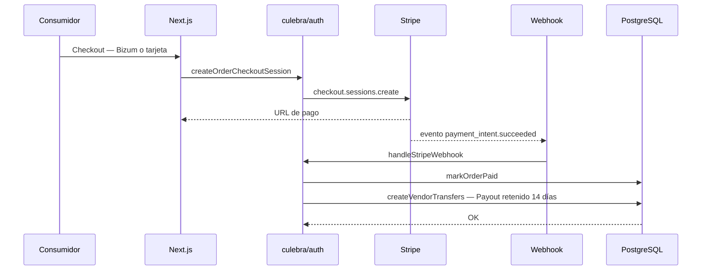
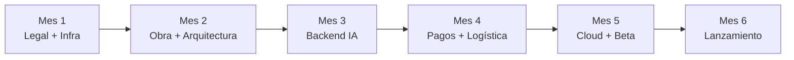

# Dossier para Socios — Marketplace Villardeciervos

Versión: para presentación interna (convencer a futuros socios)

---

## 1) Resumen ejecutivo (por qué invertir)

El proyecto crea una **S.L. tecnológica** que lanza un **marketplace multi-vendedor** para dinamizar el entorno rural de Villardeciervos (Zamora), integrando:

- **Captación de productores locales** (con enfoque inicial en **no perecederos**).
- **Compra unificada**: un cliente compra productos de distintos artesanos en una sola cesta, con **tarifa plana rural** y **consolidación** logística.
- **Pago avanzado con split automatizado** por **Stripe Connect**, con **retención legal de 14 días** (desistimiento).
- **Operativa y SLA** para proteger la reputación del portal (preparación + calidad + penalización).
- **Herramientas de control** para socios: panel admin con KPIs, rentabilidad, rappels, grupo piloto y sandbox de validación.

Diferenciador clave: **showroom físico rural + consolidación logística** en Villardeciervos, algo que agregadores digitales de capital no igualan.

---

## 2) A quién sirve (actores y propuesta de valor)

### Productores (VENDORS)

- **Cero coste de entrada** y sin riesgo de compra/stock por parte del marketplace.
- Vosotros mantenéis control de vuestro margen y catálogo.
- El sistema asume conversión digital y custodia del componente del productor con retención legal.
- Se reduce el trabajo operativo: empaquetado/etiquetado/pesaje con apoyo de la oficina.

### Consumidores (CONSUMERS)

- Catálogo unificado (varios artesanos en una sola compra).
- Envío con tarifa plana y consolidación.
- Pago moderno (tarjeta + wallets + **Bizum**).
- Experiencia fiable por SLA del productor.

### Socios (ADMIN/INVERSIONISTAS)

- Modelo escalable (SaaS + marketplace multi-vendedor).
- Control por métricas: KPIs, rentabilidad por transacción, rappels y seguimiento piloto.

---

## 3) Modelo económico (comisión + retención + incentivos)

### 3.1 Comisión base del marketplace

- **15%** como comisión estándar del marketplace sobre el ingreso neto (modelo base).

### 3.2 Retención de 14 días (cumplimiento legal)

- El productor recibe su payout con retención durante **14 días**.
- Liberación automática al vencimiento (cron/webhook).

### 3.3 Rappels (plan alternativo para fidelizar volumen)

Tramos de facturación anual acumulada:

| Tramo | Facturación anual | Comisión efectiva | Mecánica del rappel |
|---|---:|---:|---|
| Bronce | hasta 5.000 €/año | 15% | estándar |
| Plata | 5.001–15.000 €/año | 12% | rappel del 3% (retroactivo/abono) |
| Oro | > 15.000 €/año | 10% | comisión final 10% + beneficios de posicionamiento |

---

## 4) Estrategia de pagos (Stripe Connect + Bizum) — Visual

### 4.1 Flujo de pago (alto nivel)



### 4.2 Enlaces recomendados (para auditoría técnica)

- Stripe Connect: https://stripe.com/connect
- Checkout Sessions: https://stripe.com/docs/payments/checkout
- (Bizum) guía Stripe (si se requiere en presentación): https://stripe.com

> Nota: los enlaces son de referencia. Si queréis, los ajusto a los URIs exactos que os interese citar en memoria.

---

## 5) Logística + SLA (por qué el marketplace no “falla”)

Catálogo inicial: **no perecederos** (miel, embutido curado, queso madurado, vino/licores, legumbres secas, conservas).

SLA del productor:

- **Stock (SLA 4h)** tras rotura.
- **Preparación (SLA 24h)** desde notificación.
- **Cut-off**: pedidos antes de 13:00h se preparan el mismo día.
- Preferencia de consumo (no caducidad cercana): 90 días (45 en quesos).
- Penalizaciones: suspensión temporal o depósito físico de stock.

Tarifa plana rural y consolidación:

- Coste de envío objetivo 4,50–5,50 € (paquetes hasta 2 kg).
- Consolidación si compra a varios artesanos.

---

## 6) Roadmap de hitos (Mes 1–6)

| Mes | Hito | Objetivo |
|---:|---|---|
| 1 | Legal + inicio infraestructura | tramitación, socio roles, habilitación local |
| 2 | Obra civil + arquitectura | hardware subvencionado, diseño UI/UX |
| 3 | Backend con IA | motor, catálogo, perfiles |
| 4 | Pagos + logística | Stripe Connect + Bizum, frontend responsivo |
| 5 | Cloud + ciberseguridad + beta | migración, pruebas de estrés, auditoría |
| 6 | Lanzamiento comercial | apertura pública y cierre expediente |

Diagrama:



---

## 7) Captación: Grupo Piloto + Fases operativas

### Grupo Piloto (5 productores de máxima confianza)

Validará:

- Stripe Connect (pasarela avanzada),
- logística hacia Madrid,
- prueba real del flujo para generar “efecto llamada”.

### Fases

- **Fase 1 (Mes 2):** selección del “menú gourmet” (miel, embutidos de caza, queso de autor, vinos/licores, conservas/mermeladas).
- **Fase 2 (Mes 3):** visitas “puerta a puerta” (café en taller) + propuesta asimétrica:
  - comisión reducida **10% primer año** para fundadores,
  - fotografía y fichas técnicas con apoyo/IA,
  - modalidad B con consolidación: el productor deja stock en trastienda.
- **Fase 3 (Mes 5):** beta:
  - 5 compras simuladas con Bizum/tarjeta,
  - verificación de alertas,
  - auditoría logística 24/48h,
  - validación split de fondos (10% S.L. / 90% productor).

---

## 8) Control y KPIs (métrica = reputación)

KPIs de preparación y calidad:

| Métrica KPI | Objetivo | Crítico |
|---|---:|---:|
| Preparados a tiempo (<24h) | >95% | <90% |
| Roturas de stock | <1% | >3% |
| Incidencias de embalaje defectuoso | 0% | >2% |
| Valoraciones web | >4,5/5 | <4,0/5 |

KPIs de rentabilidad:

- Beneficio por transacción = comisiones − costes imputables
  (amortización maquinaria, envasado, transporte y costes asociados).

---

## 9) Viabilidad financiera (a 3 años)

### Inversión elegible (mínimo)

| Partida | Importe neto | Justificación |
|---|---:|---|
| Desarrollo tecnológico | 24.000 € | DAW (6 meses) |
| Hardware informático | 3.000 € | portátiles + NAS |
| Red + ciberseguridad | 1.500 € | firewall + routers |
| Logística | 1.500 € | báscula + impresora etiquetas |
| **Total** | **30.000 €** | umbral |

### Gastos de lanzamiento ordinarios (no subvencionables)

- Constitución S.L.: 350 €
- Tasas legalización y depósito: 320 €/año
- SaaS no permanente: 1.500 €
- Caja complementaria: 10.000 €
- Caja total inicial: **40.000 €**

### Proyección (escenario pesimista)

| Concepto | Año 1 (6 meses) | Año 2 | Año 3 |
|---|---:|---:|---:|
| Ingresos totales | 7.500 € | 30.000 € | 55.000 € |
| EBITDA | +700 € | +14.400 € | +35.400 € |
| Beneficio neto disponible | +595 € | +12.240 € | +30.090 € |

Punto de equilibrio estimado: **Mes 7**.

---

## 10) DAFO (resumen)

**Fortalezas**

- 74% inversión cubierta.
- Modelo tecnológico escalable sin riesgo de stock.
- Coste fijo cero en local (cesión por socio).
- Perfil DAW cualificado con optimización por IA.

**Debilidades**

- Dependencia de un único desarrollador web.
- Falta de marca inicial.
- Necesidad de adelantar liquidez.
- Estacionalidad de tienda física.

**Oportunidades**

- Alto ticket medio gourmet.
- 68% turistas proceden de Madrid (patrón web).
- Campañas en invierno con inversión rural.
- Fondos europeos complementarios (La Raya).

**Amenazas**

- Brecha digital en productores.
- Costes logísticos en transporte rural.
- Copia del modelo por agregadores.
- Despoblación y menor tracción física en invierno.

---

## 11) Credibilidad visual (evidencia de flujo)

Ejemplo de pantalla de estado de pedido (captura local):

> Si vas a entregar este dossier a terceros, conviene copiar la imagen al repositorio bajo `docs/imagenes/` y referenciarla con ruta relativa.


---

## 12) Glosario de términos

> Para facilitar la lectura a todos los perfiles, explicamos aquí los conceptos técnicos y de negocio que aparecen en este documento.

| Término | Qué significa en este contexto |
|---|---|
| **Marketplace** | Plataforma web donde varios vendedores independientes ofrecen sus productos en un único escaparate digital (como Amazon, pero rural y propio). |
| **Multi-vendedor** | El sistema permite que varios artesanos o productores tengan su propia "tienda" dentro de la misma plataforma, sin interferir unos con otros. |
| **S.L. (Sociedad Limitada)** | Forma jurídica de empresa en España con responsabilidad económica limitada al capital aportado por los socios. |
| **Stripe Connect** | Servicio de pagos internacionales que permite dividir automáticamente el dinero de una venta entre el marketplace y cada vendedor, cumpliendo la normativa financiera europea. |
| **Bizum** | Sistema de pago instantáneo entre particulares o a comercios, muy popular en España, que opera a través del móvil vinculado a una cuenta bancaria. |
| **Payout** | Transferencia del dinero recaudado desde la plataforma hacia la cuenta bancaria del productor. En este modelo se retiene 14 días por ley antes de liberarlo. |
| **Retención de 14 días** | Obligación legal (Directiva europea de consumo) que permite al comprador desistir de la compra. Durante ese plazo, el dinero queda retenido antes de pagarse al productor. |
| **Split automatizado** | División automática del importe de cada venta: un porcentaje va al marketplace (comisión) y el resto al productor, sin intervención manual. |
| **Webhook** | Notificación automática que envía Stripe al sistema en tiempo real cuando ocurre un evento, por ejemplo cuando un pago se confirma. |
| **SLA (Service Level Agreement)** | Acuerdo de nivel de servicio: compromiso medible de calidad y tiempo de respuesta. Aquí define, por ejemplo, que el productor debe preparar el pedido en menos de 24 horas. |
| **KPI (Key Performance Indicator)** | Indicador clave de rendimiento. Métrica concreta que permite saber si el negocio va bien, por ejemplo: % de pedidos preparados a tiempo o valoración media del cliente. |
| **EBITDA** | Beneficio de la empresa antes de descontar impuestos, amortizaciones y gastos financieros. Es el indicador de rentabilidad operativa más usado en análisis de negocio. |
| **Punto de equilibrio** | Momento en que los ingresos cubren exactamente todos los costes. A partir de ese punto, la empresa empieza a generar beneficio real. |
| **Rappel** | Descuento retroactivo sobre la comisión que se aplica al productor cuando supera un determinado volumen de ventas acumulado en el año. Incentiva la fidelidad y el crecimiento. |
| **Comisión** | Porcentaje que el marketplace retiene sobre cada venta como contraprestación por el servicio (escaparate, pagos, logística, soporte). |
| **Consolidación logística** | Agrupar en un único envío los productos de distintos artesanos que compró el mismo cliente, para reducir costes y simplificar la recepción. |
| **Tarifa plana rural** | Precio fijo de envío independientemente del número de artesanos incluidos en el pedido, diseñado para hacer competitivo el coste logístico en zonas rurales. |
| **Grupo piloto** | Conjunto reducido de 5 productores de máxima confianza que prueban el sistema antes del lanzamiento público para detectar errores y generar primeras ventas reales. |
| **Sandbox** | Entorno de pruebas seguro, separado del sistema real, donde se pueden simular compras, pagos y flujos sin mover dinero real ni afectar a clientes. |
| **DAW (Desarrollo de Aplicaciones Web)** | Titulación oficial de Formación Profesional que acredita al desarrollador para diseñar, programar y mantener aplicaciones web. |
| **SaaS (Software as a Service)** | Modelo de software en la nube que se paga por uso mensual o anual, sin necesidad de comprar ni instalar nada. Por ejemplo, las herramientas de correo, contabilidad o diseño que usamos en el día a día. |
| **NAS (Network Attached Storage)** | Dispositivo de almacenamiento conectado a la red local, como un disco duro compartido accesible desde varios ordenadores de la oficina. |
| **Firewall** | Sistema de seguridad (hardware o software) que controla y filtra el tráfico de red para proteger los equipos de accesos no autorizados. |
| **UI/UX** | UI (Interfaz de Usuario): diseño visual de la web o app. UX (Experiencia de Usuario): facilidad e intuición con que el usuario navega por ella. |
| **Backend** | Parte del sistema que el usuario no ve: base de datos, lógica de negocio, procesamiento de pedidos y pagos. Se ejecuta en el servidor. |
| **Frontend** | Parte visible de la web o app con la que interactúa directamente el usuario: menús, botones, pantallas de compra, etc. |
| **Responsivo** | Diseño web que se adapta automáticamente a cualquier tamaño de pantalla (móvil, tablet, ordenador). |
| **DAFO** | Análisis estratégico que estudia las Debilidades, Amenazas, Fortalezas y Oportunidades de un proyecto o empresa. |
| **CTA (Call to Action)** | Llamada a la acción: mensaje directo que invita al interlocutor a dar un paso concreto (firmar, invertir, contactar, etc.). |
| **Pipeline de captación** | Proceso estructurado para identificar, contactar y convertir a nuevos productores o clientes en participantes activos de la plataforma. |
| **Fondos La Raya** | Programa de financiación europeo orientado a proyectos de desarrollo rural en zonas fronterizas o despobladas, como la comarca de Zamora. |

---

## 13) Identidad corporativa, Packaging y Logística desde Villardeciervos

El etiquetado y la preparación logística centralizada desde la oficina de Villardeciervos es la mejor solución operativa. Resuelve la **brecha digital** de los pequeños productores locales de la Sierra de la Culebra y garantiza un **estándar de calidad y presentación homogéneo (Gourmet)** ante el cliente final.

---

### 🏷️ 13.1 Identidad Comercial de Lanzamiento

Para unificar la oferta artesanal bajo una marca potente que enamore al consumidor de las grandes ciudades, se propone registrar un nombre comercial con arraigo:


- **Nombre comercial propuesto:** *Sabores de la Culebra* (o *La Raya Gourmet Marketplace*).
- **Concepto de logotipo:** Isotipo limpio que combine la silueta geométrica y elegante de un lobo ibérico o la orografía de la sierra, con trazos orgánicos que simulen elementos naturales (hoja de encina o gota de miel).
- **Paleta de colores:** Verde monte (naturaleza de la reserva) · Marrón corcho/tierra · Detalles en oro viejo (calidad premium/gourmet).
- **Eslogan sugerido:** *"Esencia artesana de la tierra salvaje."*

---

### 📦 13.2 Diseño del Packaging y Tamaños Estándar

Las cajas de envío se fabricarán en **cartón ondulado de alto gramaje (Kraft de doble canal)**. El exterior irá impreso a una sola tinta (Verde monte o Negro) con el logotipo central. El interior incluirá mensajes sobre sostenibilidad y lucha contra la despoblación rural en Zamora.

Se estandarizan **tres tamaños automontables** para cubrir todo el catálogo sin disparar costes de almacenamiento:

| Tamaño | Nombre | Dimensiones | Uso idóneo | Capacidad estimada | Protección interna |
|---|---|---|---|---|---|
| **S** | Gourmet Express | 25 × 15 × 10 cm | Envíos pequeños o individuales | 1–2 tarros de miel, 2 cuñas de queso al vacío, o 3 piezas de embutido | Viruta de madera ecológica o papel de seda |
| **M** | Cesta Mediana | 35 × 25 × 12 cm | Cesta unificada del marketplace | 1 botella de vino + 1 tarro de miel + 1 cuña de queso + 2 piezas de embutido | Rejilla troquelada de cartón modular para inmovilizar vidrio |
| **L** | Lote Familiar / Navideño | 40 × 30 × 18 cm | Pedidos de alto volumen, cajas regalo corporativas | Hasta 3 botellas de vino/licor + selección amplia de embutidos, conservas y quesos | Separadores de cartón y papel de seda |

---

### 🏭 13.3 Proveedores de Packaging en Castilla y León

Se priorizan proveedores regionales para reducir costes de transporte y justificar la inversión ante el **ICECYL** (elegibilidad de subvención).

#### Proveedores de proximidad

| Empresa | Ubicación | Especialidad |
|---|---|---|
| **Hinojosa Packaging Valladolid** | Cigales, Valladolid | Líder nacional en packaging agrícola y alimentación; acabados ecológicos para ecommerce |
| **Martín Rodrigo S.A. — MAROSA** | Valladolid | Embalajes de cartón ondulado a medida; tiradas para botellas y lotes gourmet |
| **INECO S.A.** | Delegación en Zamora | Cajas de cartón corrugado personalizadas en múltiples formatos para empresas locales |

#### Alternativas online (sin pedido mínimo)

Para el lanzamiento del grupo piloto, si se necesitan menos de 500 unidades por tamaño:

| Plataforma | Ventaja |
|---|---|
| **Kartox / Cajeando** | Cajas 100% reciclables a medida desde pocas unidades; entrega en 24/48 h |
| **SelfPackaging** | Diseño creativo para alimentación gourmet y take-away; ideales para estuches de regalo |

---

### 💰 13.4 Tarifa Estimada de Mercado (lote inicial 1.000 uds.)

| Concepto | Coste estimado |
|---|---:|
| Caja tamaño M sin impresión | desde 0,74 € / ud. + IVA |
| Caja tamaño M con impresión premium (1 tinta, tapa) | desde 1,05 € / ud. + IVA |
| Cliché de impresión (pago único por tamaño) | ~120 € + IVA |

**Inversión estimada de arranque:** lote repartido entre los tres tamaños (300 uds. S + 500 uds. M + 200 uds. L) con logotipo personalizado → **aproximadamente 1.200 € – 1.500 €**.

> Este gasto encaja dentro de los **1.500 €** reservados en presupuesto para "Mobiliario y Equipamiento Logístico", siendo **100% elegible** para recuperar el **74% de subvención combinada**.

---

## 14) Modelo Logístico: Distribuidores, no Envasadores

Al operar como **meros distribuidores logísticos** —sin manipular directamente el producto alimenticio— habéis tomado la decisión operativa más eficiente y segura para el lanzamiento en Villardeciervos. Esta estrategia reduce drásticamente las barreras burocráticas iniciales, minimiza la responsabilidad legal ante las autoridades de Consumo y permite arrancar de forma inmediata.

---

### 🛡️ 14.1 Ventajas Legales y de Costes

| Ventaja | Detalle |
|---|---|
| **Exención del Registro Sanitario Industrial (RGSEAA)** | Al no abrir ni manipular el producto (no se toca el embutido, el queso ni la miel), no es necesario tramitar el Registro de Envasadores. El responsable sanitario único ante la Junta de Castilla y León sigue siendo el productor artesano, cuyo número de registro consta en el envase interior. |
| **Coste cero en maquinaria de envasado** | Sin envasado en sede, se elimina la compra de termoselladoras, sistemas al vacío o líneas de esterilización. Los 1.500 € de la partida logística se destinan íntegramente a cajas, báscula e impresora de etiquetas. |
| **Simplificación del local** | El espacio físico en Villardeciervos es legalmente una **oficina y almacén logístico de paquetería limpia**. Sanidad no exige azulejos, lavabos de pedal ni protocolos APPCC complejos. |

---

### 📦 14.2 Etiquetado de la Caja Exterior (Master Box)

Aunque se respetan al 100% las etiquetas originales de los artesanos en el interior, la normativa de transporte de la UE y el estándar del comercio electrónico exigen que la caja exterior esté correctamente identificada.

El sistema imprimirá automáticamente una **etiqueta logística exterior única** con los siguientes elementos:

| Elemento | Contenido |
|---|---|
| **Logotipo comercial** | *Sabores de la Culebra* (marca de territorio) |
| **Datos del distribuidor** | [Nombre S.L.] · Villardeciervos (Zamora) · CIF: [el vuestro] |
| **Mención comercial obligatoria** | *"Distribuido por [S.L.]. Contiene productos alimenticios no perecederos envasados en origen por productores autorizados."* |
| **Código de barras de envío (tracking)** | Código que lee el transportista (Correos/SEUR) y permite al cliente seguir el pedido desde el marketplace |
| **Pictogramas de seguridad logística** | 🍷 Frágil · ↑↑ Manténgase en posición vertical (para botellas y botes de vidrio) |

---

### 🛠️ 14.3 Protocolo Diario en la Trastienda (a partir del Mes 7)

Flujo de trabajo real para empaquetar pedidos consolidados:

```
1. RECEPCIÓN   → El Socio Comercial recibe en el local las unidades
                 cerradas y etiquetadas que traen los productores piloto.

2. COTEJO      → Se verifica que el precinto de seguridad del productor
                 (sello de cera, plástico al vacío) está intacto.

3. PICKING     → Se introducen los productos del pedido en la caja
                 de cartón corrugado (Tamaño S, M o L).

4. ACOLCHADO   → Se rellena el espacio sobrante con viruta ecológica
                 o rejilla protectora para inmovilizar el vidrio.

5. CIERRE      → Se precinta con cinta adhesiva personalizada,
                 se imprime la etiqueta exterior y se deposita
                 en la zona de recogida del transportista.
```

---

### 🏁 14.4 Conclusión: Intermediación Tecnológica de Mínimo Riesgo

Con este enfoque, el proyecto se convierte en un modelo de **pura intermediación tecnológica y de servicios**:

- Los **productores** hacen lo que mejor saben (envasar con su registro sanitario propio).
- La **S.L.** aporta la tecnología web con IA y el canal de distribución rural.
- El **riesgo operativo** queda reducido a la cifra más baja posible en el mercado actual.

> Toda la cadena logística, los requisitos de etiquetado y la operativa están perfectamente definidos para la **mínima inversión** y la **máxima elegibilidad de subvención**.

---

## 15) Costes Operativos Fijos: Suministros y SaaS

Todos los importes se han calculado con **tarifas reales de mercado vigentes**, adaptadas a la operativa de una micropyme en el entorno rural de Zamora.

---

### 💡 15.1 Suministro Eléctrico

Al centrarse en productos no perecederos, no hay maquinaria de frío industrial. El consumo se limita a climatización eficiente (bomba de calor), iluminación LED y equipos informáticos.

| Concepto | Detalle |
|---|---|
| **Potencia contratada recomendada** | 4,6 kW (climatización + iluminación + hardware simultáneos, sin saltos) |
| **Coste fijo (término de potencia)** | ~15 € / mes |
| **Coste variable (consumo estimado)** | ~35 € / mes |
| **Total mensual estimado** | **50 € / mes** |
| **Total anual** | **600 € / año** |

---

### 🌐 15.2 Internet Rural de Alta Velocidad

La conexión es crítica para la gestión del marketplace en tiempo real y la sincronización con las APIs de Stripe.

| Opción | Descripción | Tarifa media |
|---|---|---:|
| **A — Fibra óptica rural** | Operadores regionales (ej. Bivid Telecom, Zamora); hasta 1.000 Mb simétricos; router WiFi 6 e instalación incluidos | ~25 € / mes |
| **B — Starlink (satélite)** | Para locales sin acometida de fibra; 100–200 Mbps; datos ilimitados | ~35 € / mes |
| **Seleccionado (prudente)** | Opción A como base, con B como contingencia | **30 € / mes** |

**Total anual: 360 € / año.**

---

### 💻 15.3 Suscripciones de Software (SaaS)

#### A. Infraestructura cloud e IA del marketplace

| Herramienta | Uso | Coste mensual |
|---|---|---:|
| **Alojamiento web (AWS / Azure)** | Servidor virtualizado escalable, SSL y CDN para carga rápida desde Madrid | ~25 € |
| **Stripe Connect** | Pasarela de pagos — sin coste fijo; comisión variable descontada de cada transacción | 0 € fijo |
| **GitHub Copilot / Claude Pro** | Asistente IA para el DAW: resolución de bugs y optimización de código | ~20 € |

#### B. Gestión, ofimática y facturación

| Herramienta | Uso | Coste mensual |
|---|---|---:|
| **Holded / Cuéntica** | Facturación electrónica con IVA 21% y libro diario de la S.L. | ~25 € |
| **Google Workspace / Microsoft 365** | Correo corporativo (ej. info@saboresdelaculebra.com) + almacenamiento (2 licencias) | ~12 € |
| **Mailchimp / Brevo** | Email marketing automatizado para la base de datos de clientes | ~18 € |

**Total SaaS mensual: 100 € / mes · Total anual: 1.200 € / año.**

---

### 📊 15.4 Cuadro Resumen: Partida de Costes Fijos Operativos

La partida presupuestada de **"Gastos de Oficina, Suministros y Gestoría"** se valida matemáticamente:

| Concepto | Coste mensual |
|---|---:|
| Luz del local | 50 € |
| Internet rural de alta velocidad | 30 € |
| Suscripciones de software (SaaS) | 100 € |
| Cuota fija de gestoría (contabilidad e impuestos) | 120 € |
| **TOTAL COSTES FIJOS OPERATIVOS** | **300 € / mes** |

> **Coste anual total: 3.600 € / año** — exactamente la partida presupuestada.

**Conclusión para los socios:** Los 3.600 € anuales cubren al céntimo la totalidad de los costes fijos de suministros, internet, licencias de software y asesoría contable. Sin gasto de alquiler (local cedido en comodato), la startup operará con una de las **estructuras de costes fijos más ligeras y seguras del mercado tecnológico actual**.

---

## 16) Marco Legal y Protección del Proyecto

Antes de mostrar el software, la arquitectura técnica o los planes de viabilidad a cualquier tercero (productores piloto, proveedores de packaging, inversores), la S.L. en constitución dispone de un **Acuerdo de Confidencialidad (NDA)** listo para firmar.

### Documentos legales disponibles

| Documento | Cuándo firmarlo | Archivo |
|---|---|---|
| **DOC-01 · NDA — Acuerdo de Confidencialidad** | Antes de cualquier reunión técnica o comercial con productores piloto, proveedores o inversores | [`Legal_NDA_Acuerdo_Confidencialidad.md`](./Legal_NDA_Acuerdo_Confidencialidad.md) |
| **DOC-02 · Contrato de Adhesión + SLA** | Al incorporar a cada productor artesano como vendedor de la plataforma | [`Legal_NDA_Acuerdo_Confidencialidad.md`](./Legal_NDA_Acuerdo_Confidencialidad.md) |

### Puntos clave del NDA

- **Duración:** 3 años desde la firma, independientemente de si se formaliza o no el contrato definitivo.
- **Cobertura:** código fuente, arquitectura del software, integración de pagos (Stripe/Bizum), costes, viabilidad, estrategia de marketing y diseño de packaging.
- **Propiedad intelectual:** la firma del NDA no otorga ninguna licencia ni derecho sobre el software o la marca.
- **Jurisdicción:** Juzgados y Tribunales de Zamora capital.
- **Penalización:** incumplimiento habilita reclamación por daños económicos y de reputación de marca.

> Rellenar los campos `[...]` del modelo antes de cada firma. Se recomienda revisión por abogado o gestor especializado.

---

## 17) Llamada a la acción (CTA para socios)

Solicitamos compromiso de socios con una visión clara:

- Validar rápido el piloto (Mes 2–6).
- Activar pipeline de captación y recurrencia con rappels y SLA.
- Escalar con control (KPIs/rentabilidad) y cumplimiento legal (retención 14 días).
- Firmar el NDA antes de cualquier reunión técnica o comercial con terceros.

