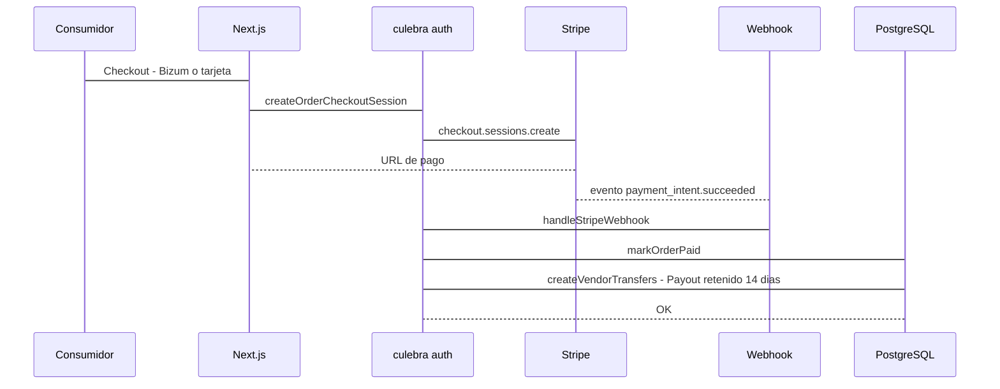
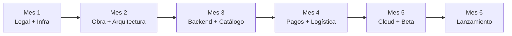

# Dossier Marketplace Villardeciervos


---

## 1) Resumen ejecutivo (por qué invertir)

> **Versión de una página (decisión de constitución):** [`Resumen_Ejecutivo_Socios.md`](./Resumen_Ejecutivo_Socios.md).

El proyecto crea una **S.L. tecnológica** que lanza un **marketplace multi-vendedor** para dinamizar el entorno rural de Villardeciervos (Zamora). La tesis de inversión para socios **no** es maximizar la rentabilidad a corto plazo, sino:

1. **Estructurar una inversión elegible de 30.000 €** (capital social **40.000 €** = elegible + corriente) que permita captar la máxima subvención posible (**hasta el 74 %** a fondo perdido: ICECYL + complemento Diputación / La Raya).
2. Construir una **operativa viable de bajo riesgo** (intermediación sin stock propio, portes a cargo del cliente, comisión con suelo).
3. Aceptar un horizonte de **crecimiento prudente**: el escenario base proyecta pérdidas en Y1–Y3 (neto acum. 3 años ≈ **−17.500 €**) y solo equilibrio fino hacia Y5; esfuerzo neto tras ayuda ≈ **17.800 €**.

Sobre **30.000 €** de inversión elegible (marco canónico Plan de Viabilidad / memoria §25):

| Concepto | Importe |
|---|---:|
| Ayuda ICECYL (40 %) | 12.000 € |
| Complemento Diputación / La Raya (hasta 74 %) | 10.200 € |
| **Subvención total (74 %)** | **22.200 €** |
| Capital social / caja | **40.000 €** |
| **Esfuerzo neto de referencia** | **≈ 17.800 €** |

*Desarrollo tecnológico en dos contratos de servicio (A.I **14.500 €** + A.II **8.500 €**) ≤ umbral contrato menor.*

El marketplace integra:

- **Captación de productores locales** (enfoque inicial en **no perecederos**).
- **Compra unificada**: un cliente compra productos de distintos artesanos en una sola cesta, con **tarifa plana de envío 6,50 €** (siempre a cargo del cliente; **sin envío gratis** ni absorción de portes por la S.L.) y **consolidación** logística cuando proceda.
- **Pago avanzado con split automatizado** por **Stripe Connect**, con **retención legal de 14 días** (desistimiento).
- **Comisión base 17 %** con **mínimo 4,00 €/pedido** (se aplica el mayor).
- **Operativa y SLA** para proteger la reputación del portal.
- **Herramientas de control** para socios: panel admin con KPIs, rentabilidad, rappels, grupo piloto y sandbox.

Diferenciador clave: **showroom físico rural + consolidación logística** en Villardeciervos, algo que agregadores digitales de capital no igualan.  
**Concepto de tienda** (referente La Abacería → híbrido escaparate/trastienda): [`Concepto_Tienda_Showroom_Villardeciervos.md`](./Concepto_Tienda_Showroom_Villardeciervos.md).

**Documentación del expediente.** Para socios que participen en solicitudes o justificación de ayudas: [`Marco_Documentacion_Expediente.md`](./Marco_Documentacion_Expediente.md) (memoria de proyecto vs justificativa vs cuaderno de ejecución).

---

## 1.bis) Evidencia de mercado y territorio (datos oficiales)

Base estadística para socios (no infla demanda; separa **dato oficial** e **hipótesis**). Detalle: `docs/datos_ine/Tabla_Maestra_Mercado.md` y Excel `Modelo_Cuenta_Resultados_Marketplace_5_anos.xlsx` (hoja `00_KPI_Dashboard`).

### Demografía — Villardeciervos (Padrón / INE)

| Año | Habitantes |
|----:|-----------:|
| 2019 | 413 |
| 2025 | 383 |

Variación ≈ **−7,3 %**. Justifica diversificación económica digital; **no** se promete “fijar población”.

### Turismo rural — provincia de Zamora (INE EOTR)

| Año | Viajeros | Pernoctaciones | Notas |
|----:|---------:|---------------:|-------|
| 2019 | 73.640 | 164.480 | Pre-COVID |
| 2021 | 48.024 | 121.874 | Recuperación |
| 2022 | 67.224 | 149.204 | Fuerte recuperación |
| 2024 | **71.909** | **139.587** | ~1,94 noches/viajero |
| 2025 | 52.353 | 114.653 | Año completo |

Fuente: tablas INE **2073** (y corte TPX **75448** alineado a 2024). Villardeciervos **no** es punto turístico EOTR → no inventamos viajeros municipales.

Estacionalidad 2024 (viajeros): pico **agosto 12.151**; otoño activo (sep–oct). Hipótesis comercial: `visita → producto → compra online → recompra`.

### Contexto regional — Castilla y León (INE ETR 2025)

- **14,44 M** viajes de residentes con destino CyL  
- **61,56 M** pernoctaciones  
- **3.004,1 M€** gasto turístico (208 €/persona; 49 €/día)  

Es **contexto regional**, no cuota atribuible a Villardeciervos/Sierra.

### Afluencia específica — Sierra de la Culebra (Junta CyL)

- Centro del Lobo: **>42.000** visitantes en **2019**; **>160.000** acumulados desde 2015  
- Centros REN Zamora: **>96.000** visitantes en 2019  
- Berrea (sep–oct) y turismo de naturaleza promocionados por Junta/Diputación  

Correcto: “el Centro del Lobo recibió >42.000 visitantes”. Incorrecto: “la Sierra recibe 42.000 turistas”.

### Demanda alimentaria (INE EPF 2024)

Gasto medio hogares en alimentos y bebidas no alcohólicas: **5.391 €/año** (15,8 % del presupuesto). Categorías relevantes: carne 3,6 %; leche/quesos/huevos 2,0 %. Dimensiona el mercado de categorías; **no** el gasto en productos de la Culebra.

### Tesis comercial (Sanabria–La Carballeda + recompra online)

```text
TERRITORIO (productos + naturaleza + turismo Sanabria/Carballeda/Culebra)
    → MARKETPLACE
    → RESIDENTE / TURISTA (Galicia, Madrid, CyL, norte…) / CONSUMIDOR NACIONAL
    → COMPRA ONLINE → RECOMPRA
```

**Procedencia — dos capas:**

1. **Provincia Zamora (INE EOTR tabular CCAA):** pendiente de extracción; 75448 solo da Residentes ES / extranjero.  
2. **Comarca Sanabria–La Carballeda (síntesis de trabajo):** motor turístico provincial (Lago de Sanabria, Puebla, A-52, AVE Sanabria AV). Órdenes de magnitud orientativos:

| Procedencia | ~Cuota | Nota |
|-------------|-------:|------|
| Galicia | 42 % | Principal emisor; proximidad |
| Madrid | 25 % | Verano / Semana Santa; estancias más largas |
| Castilla y León | 18 % | Alta repetición |
| Asturias + País Vasco | 10 % | Activo / montaña |
| Resto | 5 % | Residual |

Estancia media comarcal ~**2,4 noches**; gasto diario estimado **48–62 €**/persona. Serie 2019–2025: resiliencia rural, boom 2020–21, estabilización y alargamiento de temporada con AVE. **No** atribuir estas cuotas a Villardeciervos ni a la serie provincial sin tabla INE.

---

## 2) A quién sirve (actores y propuesta de valor)

> **Posicionamiento (activador del territorio vs competencia, sin erosionar margen):** [`Posicionamiento_Activador_Territorio.md`](./Posicionamiento_Activador_Territorio.md).

### Productores (VENDORS)

- **Cero coste de entrada** y sin riesgo de compra/stock por parte del marketplace.
- Vosotros mantenéis control de vuestro margen y catálogo.
- El sistema asume conversión digital y custodia del componente del productor con retención legal.
- Se reduce el trabajo operativo: empaquetado/etiquetado/pesaje con apoyo de la oficina.

### Consumidores (CONSUMERS)

- Catálogo unificado (varios artesanos en una sola compra).
- **Envío con tarifa plana:** **6,50 €** por pedido, **siempre a cargo del cliente**. No hay umbral de envío gratis; la S.L. **no absorbe** el coste de etiqueta. Comparativa con gourmet zamoranas (gratis desde ~90–100 €): [`Competencia_Plataformas_Gourmet_Zamora.md`](./Competencia_Plataformas_Gourmet_Zamora.md) §4.
- Consolidación logística multiproductor cuando aplica.
- Pago moderno (tarjeta + wallets + **Bizum**).
- Experiencia fiable por SLA del productor.

### Socios (ADMIN/INVERSIONISTAS)

- Modelo pensado para **elegibilidad de ayuda** + operativa sostenible (esfuerzo neto tras 74 % sobre 30 k€ elegibles ≈ **17.800 €**; capital **40.000 €**).
- Control por métricas: KPIs, rentabilidad por transacción, rappels y seguimiento piloto.

---

## 3) Modelo económico (comisión + retención + incentivos)

### 3.1 Comisión base del marketplace

- **17 %** como comisión estándar del marketplace sobre el ingreso neto de la venta (modelo base).
- **Mínimo por pedido: 4,00 €.** Se aplica **lo que sea mayor** entre el 17 % del merchandise y 4,00 €.
  - Umbral de indiferencia: `4 ÷ 0,17 ≈ 23,5 €` de merchandise. Por debajo de ~23,5 € manda el mínimo; por encima, el 17 %.
- **Justificación 15 % vs 17 % (cerrada):** el 17 % mejora ~**+1,24 €**/pedido de margen, baja el break-even ~**1.200 € GMV/mes** y reduce pérdidas a 3 años en ~**5.240 €**, con impacto moderado al productor (−2 pp). Detalle: [`docs/Comparativa_Comision_15_vs_17.md`](docs/Comparativa_Comision_15_vs_17.md) · `Plan_Viabilidad_Marketplace_Villardeciervos.md` §5.G.

### 3.2 Retención de 14 días (cumplimiento legal)

- El productor recibe su payout con retención durante **14 días**.
- Liberación automática al vencimiento (cron/webhook).

### 3.3 Rappels por volumen (Opción A — retroactivo)

**Decisión:** tramos **Bronce / Plata / Oro** con comisión base **17 %**. Durante el año se cobra siempre el 17 %; al cierre del **año natural** se abona el rappel si corresponde. No se usa (de momento) la comisión escalonada en tiempo real.

| Tramo | Facturación anual neta del productor | Comisión efectiva | Rappel |
|---|---:|---:|---:|
| **Bronce** | Hasta 5.000 € | **17 %** | Ninguno |
| **Plata** | 5.001 – 15.000 € | **14 %** | **3 %** |
| **Oro** | Más de 15.000 € | **12 %** | **5 %** (+ beneficios de posicionamiento según disponibilidad) |

*Variante agresiva (no activa):* umbrales 6.000 / 18.000 € y Oro al 11–12 %. Solo si se quiere incentivar más volumen en una fase posterior.

**Mecánica (Opción A — recomendada):**
1. En cada pedido se detrae el **17 %** (o el mínimo 4 € si es mayor).
2. Al cerrar el año natural se suma la facturación neta de producto (sin portes, sin cancelados/devoluciones).
3. Si entra en Plata u Oro, se abona la diferencia (3 % o 5 % sobre toda la base del año).
4. Plazo de abono: **60 días** tras el 31 de diciembre (transferencia o compensación en liquidaciones).

**Ejemplo:** productor con 16.500 € de facturación neta anual → comisión bruta cobrada 17 % = 2.805 € → rappel Oro 5 % = 825 € → comisión neta S.L. = **1.980 € (12 %)**.

**Reglas de gestión:**
- Base = precio neto de producto (sin portes, impuestos, cupones).
- Sin rappel sobre pedidos cancelados o devueltos.
- Cada año se calcula de forma independiente (no consolida derechos al año siguiente).
- Modificación de tramos: preaviso mínimo **3 meses**; sin efecto retroactivo sobre el año en curso.
- Control: panel admin `/admin/rappels` con proyección en vivo, cierre de año (`RappelSettlement`) y marcar abonado (transferencia o compensación). Vista productor en liquidaciones.

Texto contractual listo: [`Clausula_Comision_Rappels_Productor.md`](./Clausula_Comision_Rappels_Productor.md) y cláusula en `Legal_NDA_Acuerdo_Confidencialidad.md` (adhesión productor).

### 3.4 Política de envíos (sin gratuidad)

| Merchandise (productos − cupón) | Cliente | Quién sufraga el porte |
|--------------------------------|--------:|------------------------|
| **Cualquier importe** | Paga **6,50 €** (tarifa plana) | **Cliente** |

**Principio:** la S.L. **no absorbe** ningún coste de etiqueta. El porte no erosiona la comisión. El productor recibe su parte sobre el producto (83 % si comisión 17 %, o el complemento tras mínimo 4 €).

Ejemplos de margen de intermediación (orientativos, sin IVA; Stripe ~1,5 % sobre GMV de producto):

| Ticket producto | Comisión (max 17 %, 4 €) | Stripe ~1,5 % | Margen bruto comisión | Envío (cliente) |
|---:|---:|---:|---:|---|
| 20 € | **4,00 €** (mínimo) | ~0,30 € | ~**3,70 €** | 6,50 € |
| 40 € | **6,80 €** | ~0,60 € | ~**6,20 €** | 6,50 € |
| 65 € | **11,05 €** | ~0,98 € | ~**10,07 €** | 6,50 € |
| 100 € | **17,00 €** | ~1,50 € | ~**15,50 €** | 6,50 € |

Constantes de diseño: tarifa plana **6,50 €**, comisión **17 %**, mínimo **4,00 €**. Implementado en `@culebra/domain` + `computeShippingQuote` / `finalizeVendorCommission`.

---

## 4) Estrategia de pagos (Stripe Connect + Bizum) — Visual

### 4.1 Flujo de pago (alto nivel)



### 4.2 Enlaces recomendados (para auditoría técnica)

- Stripe Connect: https://stripe.com/connect
- Checkout Sessions: https://stripe.com/docs/payments/checkout
- (Bizum) guía Stripe (si se requiere en presentación): https://stripe.com

> Nota: los enlaces son de referencia. Si queréis, los ajusto a los URIs exactos que os interese citar en memoria.

---

## 5) Logística + SLA (por qué el marketplace no “falla”)

Catálogo inicial: productos **estables sin refrigeración** de La Raya / Culebra / Aliste / Sanabria — miel, embutido (pieza y loncheados/tacos), queso madurado, vino/licores, repostería seca (soles, rosquillas), harina de castaña, mermeladas bajas en azúcar, legumbres. Atención: varios formatos tienen consumo preferente **30–90 días** (no “infinitos”). Detalle: [`Catalogo_Productos_La_Raya_Conservacion.md`](./Catalogo_Productos_La_Raya_Conservacion.md).

SLA del productor:

- **Stock (SLA 4h)** tras rotura.
- **Preparación (SLA 24h)** desde notificación.
- **Cut-off**: pedidos antes de 13:00h se preparan el mismo día.
- Preferencia de consumo (no caducidad cercana): 90 días (45 en quesos).
- Penalizaciones: suspensión temporal o depósito físico de stock.

Tarifa de envío y consolidación:

- **Regla de producto:** el cliente paga **siempre 6,50 €** (tarifa plana). **No hay envío gratis** ni absorción de portes por la S.L.
- Coste de etiqueta orientativo ~**5–6,50 €** (paquetes hasta ~2 kg): lo cubre el cargo al cliente.
- Consolidación si compra a varios artesanos (un solo envío al cliente cuando la operativa lo permita).
- Partida de **transportes** en PyG = logística de oficina / consolidación ligera, **no** etiquetas absorbidas.

---

## 6) Roadmap de hitos (Mes 1–6)

| Mes | Hito | Objetivo |
|---:|---|---|
| 1 | Legal + inicio infraestructura | tramitación, socio roles, habilitación local |
| 2 | Obra civil + arquitectura | hardware subvencionado, diseño UI/UX |
| 3 | Backend y catálogo | motor multi-vendedor, perfiles, paneles (interno y/o proveedor) |
| 4 | Pagos + logística | Stripe Connect + Bizum, frontend responsivo |
| 5 | Cloud + ciberseguridad + beta | migración, pruebas de estrés, auditoría |
| 6 | Lanzamiento comercial | apertura pública y cierre expediente |

Diagrama:



---

## 7) Captación de productores y riesgo de multi-homing

> **Tesis:** no pelear por exclusividad al inicio. Objetivo = ser el **canal principal o prioritario**, no el único. Aceptar multi-homing y competir por comodidad, consolidación logística, showroom y rappels.  
> **Posicionamiento (qué sí / adaptar / no):** [`Posicionamiento_Activador_Territorio.md`](./Posicionamiento_Activador_Territorio.md).  
> **Estrategia operativa completa (segmentos, fases, KPIs, riesgos):** [`Estrategia_Captacion_Productores.md`](./Estrategia_Captacion_Productores.md).  
> **Argumentario y guion de visita:** [`Argumentario_Captacion_Productores.md`](./Argumentario_Captacion_Productores.md).  
> **Concepto de showroom / tienda física:** [`Concepto_Tienda_Showroom_Villardeciervos.md`](./Concepto_Tienda_Showroom_Villardeciervos.md).  
> **Competencia digital provincial:** [`Competencia_Plataformas_Gourmet_Zamora.md`](./Competencia_Plataformas_Gourmet_Zamora.md) (Exquisiteza, Gourmet Box, TodeToro, Pedro y Ana).  
> **Productores embutidos/caza:** [`Productores_Objetivo_Embutidos_Caza_Culebra.md`](./Productores_Objetivo_Embutidos_Caza_Culebra.md).

### 7.1 Diagnóstico del riesgo real

| Comportamiento del productor | Probabilidad | Riesgo para la S.L. |
|---|---|---|
| Web propia + ferias | Alta | Medio (competencia parcial) |
| Amazon / Etsy | Media-baja (muchos aún no digitalizados) | Alto si se digitalizan |
| Plataformas gourmet Zamora (Exquisiteza, Gourmet Box, TodeToro…) | Media-alta | Alto (multi-homing provincial) |
| Varios marketplaces regionales | Media | Alto (multi-homing) |
| Exclusividad total con nosotros | Muy baja | — |
| Probaros y quedarse si funciona | Alta | **Oportunidad** |

Pedir exclusividad total al principio es **casi imposible y poco recomendable**.

### 7.2 Estrategia por fases

#### Fase 1 — Grupo piloto (5 productores de máxima confianza)

- **Objetivo:** validar flujo completo (alta, pedidos, preparación, pago, consolidación).
- **Perfil:** artesanos conocidos, no perecedero de calidad, cierta predisposición digital.
- **Oferta de arranque:**
  - comisión reducida **12–14 % el primer año** (vs 17 % estándar);
  - ayuda real con fotos, fichas y optimización;
  - prioridad de posicionamiento en la web;
  - acompañamiento personal (visitas, WhatsApp directo).
- Validará Stripe Connect, logística a demanda nacional/turística y el “efecto llamada”.

#### Fase 2 — Expansión local (puerta a puerta + referidos)

- Visitas en taller/obrador (muy efectivo en medio rural).
- **Guion y argumentario completo:** [`docs/Argumentario_Captacion_Productores.md`](docs/Argumentario_Captacion_Productores.md).
- Argumentario breve:
  - “No te compramos stock, solo cobras si vendes”.
  - “Un solo envío aunque el cliente compre a varios productores”.
  - “Showroom físico en Villardeciervos que da confianza”.
  - “Comisión competitiva + rappels si creces con nosotros”.
- Usar al piloto como **prescriptores** (boca-oreja).
- Empezar casi siempre por **escaparate** o **stock mínimo** (no depósito completo).

#### Fase 3 — Productores ya digitalizados

- Enfoque en quien ya vende online (web propia o Amazon).
- Propuesta: menos CAC, consolidación logística, presencia territorial, menos dependencia de la publicidad de los grandes.

### 7.3 Cómo reducir que se vayan a otros marketplaces

| Palanca | Acción concreta | Efectividad |
|---|---|---|
| Comisión y rappels | 17 % base + rappels 14 % / 12 % | Alta |
| Coste de cambio | Ayuda intensa con fichas, fotos y catálogo al entrar | Alta |
| Consolidación logística | Diferencial difícil de copiar por Amazon o webs individuales | Muy alta |
| Showroom físico | Confianza y prueba de producto | Alta |
| Acompañamiento humano | Trato cercano, incidencias rápidas | Alta (rural) |
| Datos y feedback | Informes sencillos de ventas y valoraciones | Media |
| Exclusividad parcial | Solo referencias o campañas (ej. lotes Navidad) | Media |
| Exclusividad total | **Evitar al principio** (espanta) | Baja / contraproducente |

### 7.4 Argumentario comercial (guion)

> Documento operativo completo (beneficios, modalidades de compromiso, miedos, guion de visita al obrador, objeciones y seguimiento): [`docs/Argumentario_Captacion_Productores.md`](docs/Argumentario_Captacion_Productores.md).

> No te pedimos que dejes de vender en otros sitios.  
> Te ofrecemos un canal adicional con ventajas reales: comisión clara y rappels si creces; el cliente puede comprar tus productos junto con los de otros artesanos en un solo envío; presencia física en Villardeciervos; ayuda con fichas y fotos; cobro automático y transparente.  
> Si te funciona, irás metiendo más producto. Si no, no pierdes nada.  
> **Empezamos con poco y si no te compensa, lo recoges. ¿Probamos con dos referencias?**

### 7.5 Riesgos y mitigación

| Riesgo | Mitigación |
|---|---|
| Se digitaliza y se va a Amazon | Mejor acompañamiento + consolidación + rappels atractivos |
| Multi-homing (varios marketplaces) | Aceptarlo; competir por ser el que mejor le funciona |
| Deja de subir stock / responde mal | SLA claro + penalizaciones progresivas (aviso → suspensión) |
| Grandes exigen condiciones especiales | Rappels o condiciones solo con alto volumen |
| Dependencia de muy pocos productores | Objetivo: **10–15 productores activos en 18–24 meses** |

### 7.6 Indicadores de captación y retención

- Productores **activos** (≥ 1 venta en últimos 90 días).
- % del piloto activos a los 6 y 12 meses.
- Facturación media por productor.
- % que alcanza tramo Plata u Oro.
- Tiempo medio desde el alta hasta la primera venta.
- Nº que también vende en Amazon/Etsy (grado de multi-homing).

### 7.7 Calendario operativo (enlace con desarrollo)

- **Mes 2:** selección del “menú gourmet” (miel, embutidos, queso, vinos/licores, conservas).
- **Mes 3:** visitas puerta a puerta + oferta fundadores (12–14 % año 1 + fotos/fichas + consolidación).
- **Mes 5:** beta con 5 compras controladas, alertas, auditoría logística, split 17 % / 83 % (o mínimo 4 €).

Panel: `/admin/piloto`.

---

## 8) Control y KPIs (métrica = reputación + negocio)

### 8.1 KPIs operativos (piloto / lanzamiento)

| Métrica KPI | Objetivo | Crítico |
|---|---:|---:|
| Preparados a tiempo (<24h) | >95% | <90% |
| Roturas de stock | <1% | >3% |
| Incidencias de embalaje defectuoso | 0% | >2% |
| Valoraciones web | >4,5/5 | <4,0/5 |
| Pedidos con trazabilidad completa | ≥90% | <80% |
| Clientes recurrentes (repiten compra) | a medir en piloto | — |
| Productores activos (venta en 90 días) | crecer hacia 10–15 en 18–24 m | estancamiento &lt; 5 |
| % piloto activos a 6 / 12 meses | ≥ 80 % / ≥ 60 % | abandono masivo |
| Tiempo alta → 1.ª venta | &lt; 30 días | &gt; 60 días |
| Multi-homing (Amazon/Etsy detectado) | a medir (no es fallo) | — |

### 8.2 KPIs económicos (marketplace de intermediación)

| KPI | Definición | Uso |
|---|---|---|
| **GMV** | Ventas de vendedores en la plataforma | Actividad; **no** es ingreso de la SL |
| **Ingresos SL** | Comisión **17 %** × GMV (con mínimo 4 €/pedido en operativa) | Facturación propia |
| **Take rate** | Ingresos / GMV | Debe situarse ~17 % |
| **Cobertura de gastos** | Ingresos / Gastos | >100% = umbral operativo |
| **Resultado neto** | Tras gastos, amortización e IS orientativo | Viabilidad; caso base acepta pérdidas iniciales |
| **GMV de equilibrio** | ≈ gastos fijos ÷ margen contribución (~15,5 % a comisión 17 %) | Base: **≈ 8.100 €/mes** (~130 pedidos; ~4,3/día) con fijos 1.250 € |
| **GMV / vendedor / mes** | GMV ÷ n.º vendedores activos | Intensidad comercial |

Cuadro de mando visual (gráficos dinámicos): Excel `Modelo_Cuenta_Resultados_Marketplace_5_anos.xlsx` → hoja **`00_KPI_Dashboard`**.

KPIs de rentabilidad por pedido:

- Beneficio por transacción ≈ comisión − cuota de medios de pago (el porte **no** resta: lo paga el cliente).
- En modelo intermediación **no** se imputa COGS de mercancía (el stock es del vendedor).

---

## 9) Viabilidad financiera (a 5 años — escenario conservador)

### Inversión elegible (30.000 €) y lógica de ayuda

Alineada al **Plan de Viabilidad §3.A** y memoria técnica §25.2. El desarrollo tecnológico se contrata en **dos servicios** ≤ **15.000 €** sin IVA cada uno (umbral contrato menor LCSP art. 118), con objeto y entregables distintos:

| Partida | Importe | Notas |
|---|---:|---|
| **A.I** Núcleo marketplace | **14.500 €** | Arquitectura, catálogo, pedidos/checkout, admin base |
| **A.II** Pagos, seguridad y producción | **8.500 €** | Pasarela/retención 14 d, cierre admin, seguridad, despliegue |
| Adecuación de oficina | 2.500 € | Electricidad, pintura, climatización |
| Equipamiento informático | 2.000 € | Portátiles, pantallas, NAS |
| Red y ciberseguridad | 1.500 € | Router, firewall, SAI |
| Mobiliario y logística ligera | **1.000 €** | Puestos, báscula, etiquetadora |
| **Total elegible ICECYL** | **30.000 €** | |
| SaaS + lanzamiento (corriente) | 10.000 € | No subvencionable como inversión |
| **Capital / caja total** | **40.000 €** | |

**Prioridad del caso base:** justificar y ejecutar la inversión elegible para maximizar la ayuda (hasta **74 %** sobre **30.000 €** → **≈ 22.200 €**), no demostrar un ROI agresivo. Esfuerzo neto de referencia tras ayuda: **≈ 17.800 €**. (La hipótesis antigua de “40.000 € 100 % elegibles → 29.600 € / 10.400 €” queda como **contraste**, no como marco canónico del Plan de Viabilidad.)

### Proyección conservadora (comisión 17 % sobre GMV; sin envío gratis; RETA incluido)

> Alineada al **Plan de Viabilidad §5** (escenario estrictamente prudente). Canónica para socios e inspección.

| Concepto | Año 1 (6 meses venta) | Año 2 | Año 3 | Año 4 | Año 5 |
|---|---:|---:|---:|---:|---:|
| Pedidos / mes (orientativo) | 35–40 | 60–70 | 95–105 | ≈ 130 | ≈ 160 |
| GMV vendedores | **14.000 €** | **48.000 €** | **75.000 €** | **100.000 €** | **125.000 €** |
| Ingresos SL (17 %) | **2.380 €** | **8.160 €** | **12.750 €** | **17.000 €** | **21.250 €** |
| Gastos estimados (incl. RETA neto) | ≈ 6.800 € | ≈ 16.500 € | ≈ 17.500 € | ≈ 18.500 € | ≈ 19.000 € |
| Resultado neto (orientativo, **base comodato**) | ≈ **−4.420 €** | ≈ **−8.340 €** | ≈ **−4.750 €** | ≈ **−1.500 €** | ≈ **+2.250 €** |

- **Neto acumulado 3 años ≈ −17.500 €**; a 5 años ≈ **−16.800 €**.
- La viabilidad de los primeros años descansa en **cobrar la subvención**, costes bajos y **no** absorber portes — no en dividendos tempranos.
- Marco canónico: **30.000 €** elegibles + **10.000 €** corriente / capital **40.000 €** → esfuerzo neto ≈ **17.800 €** tras 74 % (≈ 22.200 €).
- **No** se proyectan dividendos relevantes en Y1–Y3 del caso base.
- Escenarios **Realista** y **Optimista** en el panel/Excel = sensibilidad al alza; el antiguo PyG con +12 k€ / +30 k€ en Y2–Y3 es **optimista de contraste**, no “prudente”.
- **GMV ≠ ventas propias de la SL.** IS orientativo; IVA fuera de la PyG.

Punto de equilibrio operativo (base, comisión **17 %**): **≈ 8.100 € GMV/mes** (~**130 pedidos/mes**, ~**4,3 pedidos/día**) con fijos **≈ 1.250 €/mes**. Con el GMV prudente, el equilibrio cómodo se retrasa al **Año 4**. Detalle: `Plan_Viabilidad_Marketplace_Villardeciervos.md` §5.F–§5.G. Sensibilidad de costes (fijos, marketing, RETA, alquiler): **§5.M**.

**Anexos contractuales:** **§9.A** (GMV ↔ pedidos ↔ clientes) y **§9.B** (embudo de conversión web Año 1). Cuadro de mando: **`/admin/plan`** + Excel de cuenta de resultados.

---

## 9.A) Anexo — Hipótesis económica contrastada (Pacto de Socios)

> **Naturaleza.** Hipótesis de trabajo contrastada con la proyección conservadora de §9 (ticket medio **65 €**, comisión **17 %**, envío **6,50 €** siempre al cliente). No constituye compromiso de resultado ni cifra auditada de demanda.

### A.1 Conversión de GMV a pedidos reales

Criterio de prudencia: **ticket medio 65 €** por cesta unificada.

| Horizonte | GMV (conservador) | Pedidos equivalentes | Ritmo orientativo | Lectura operativa |
|---|---:|---:|---|---|
| **Año 1** (6 meses de venta) | 14.000 € | ~**215** (~36–40/mes) | **~1,2–1,4 pedidos/día** | Volumen absorbible sin estructura extra |
| **Año 2** | 48.000 € | ~**738** (~60–70/mes) | **~2,1–2,3 pedidos/día** | Consolidación lenta; neto ≈ −8,3 k€ |
| **Año 3** | 75.000 € | ~**1.154** (~95–105/mes) | **~3,2–3,5 pedidos/día** | Aún en pérdida / equilibrio fino |
| **Año 5** (madurez prudente) | 125.000 € | ~**1.923** (~160/mes) | **≈ 5,3 pedidos/día** | Primer tramo con neto positivo orientativo |

Cálculo: `pedidos ≈ GMV ÷ 65 €`.

### A.2 Gasto medio anual y base de clientes fieles

Patrón esperado en nicho territorial: **2–4 compras anuales** de ticket gourmet, no compra semanal.

**Objetivo de captación Año 2 (coherente con 48.000 € GMV):**

- Base activa orientativa: **~240–260 clientes** con actividad en el año  
- Comportamiento: **~3 compras × 65 €** ≈ **195 €/cliente/año**  
- Comprobación: `246 × 3 × 65 € ≈ 48.000 € GMV`

Captar ~250 usuarios (visita física + online + campañas modestas) es un objetivo **prudente**, alineado a no presuponer 3–4 pedidos/día en Y1.

### A.3 Auditoría del flujo de comisiones (17 % / 83 %)

```text
[CLIENTE COMPRA ONLINE] ──► Producto (ej. 65 €) + envío 6,50 €
                │
                ▼
        [MOTOR STRIPE CONNECT]
                │
    ┌───────────┴───────────┐
    ▼                       ▼
[INGRESOS S.L. ~17 %]   [LIQUIDACIÓN PRODUCTORES ~83 %]
Año 1:  2.380 €         Año 1: ~11.620 € repartidos
Año 3: 12.750 €         Año 3: ~62.250 € repartidos
(opex, SaaS, gestoría, RETA)  (retención legal 14 días)
(+ envío 6,50 € lo paga el cliente; no resta a la comisión)
```

| Año | GMV | Caja comisión S.L. (17 %) | Reparto productores (83 %) |
|---:|---:|---:|---:|
| 1 | 14.000 € | 2.380 € | 11.620 € |
| 2 | 48.000 € | 8.160 € | 39.840 € |
| 3 | 75.000 € | 12.750 € | 62.250 € |
| 5 | 125.000 € | 21.250 € | 103.750 € |

**Matices que los socios aceptan al anexar este documento:**

1. **Y1–Y3** pueden cerrar en pérdida / casi equilibrio: amortización, medios de pago y opex de estructura.
2. El **17 % no es margen neto puro** (Stripe ~1,5 % sobre GMV), pero **ya no se erosiona** por portes absorbidos.
3. El mínimo **4 €/pedido** protege tickets bajos; el take rate efectivo puede superar el 17 % en cestas pequeñas.
4. El control de captación digital está en **§9.B**; este §9.A fija la equivalencia GMV ↔ pedidos ↔ clientes.
5. El crecimiento ambicioso (Realista/Optimista) es **escenario positivo**, no base de justificación.

### A.4 Conclusión financiera para firma de socios

Los números son **defendibles ante la administración** porque:

- el GMV es **estrictamente prudente** (~1,2–1,4 pedidos/día en Y1);
- la aportación real tras ayuda se sitúa en **≈ 17.800 €** (marco canónico 30 k€ elegibles / 40 k€ capital);
- la operativa no depende de subsidiar envíos;
- Y1–Y3 en pérdida (~−17,5 k€ acum.) es el caso base: la subvención + costes bajos sostienen el proyecto, no los dividendos tempranos.

Al firmar / anexar este §9.A, las partes reconocen la tabla GMV–comisiones de §9, el ticket **65 €**, y que se trata de **previsión de diseño**, no de garantía.

---

## 9.B) Anexo — Métricas de conversión web (Año 1)

> **Naturaleza.** Anexo operativo: traduce los **~215 pedidos / 14.000 € GMV** del Año 1 (6 meses) en un embudo medible. Presupuesto Paid Media **contenido** (**~300–350 €/mes**, **~2.000 €** en 6 meses). No garantiza tráfico ni conversión.

### B.1 Objetivo comercial Año 1

| Indicador | Valor de referencia |
|---|---:|
| GMV | 14.000 € |
| Ticket medio | 65 € |
| Pedidos totales (6 meses) | ~**215** |
| Pedidos / mes | ~**36–40** |
| Comisión bruta S.L. (17 %) | ~**11,05 €** / pedido (ticket 65 €) |
| Margen de comisión usable (tras Stripe ~1,5 %) | ~**9,5–10,5 €** / pedido |
| Envío | **6,50 €** siempre al cliente (no resta a la comisión) |

### B.2 Embudo de referencia (visita → pedido)

Hipótesis prudente de **conversión sesión → pedido = 2 %** (rango **1,5–3 %**).

| Escalón | Fórmula / lectura | Valor orientativo |
|---|---|---:|
| Pedidos / mes | Objetivo | **~36** |
| Sesiones / mes (a 2 %) | `36 ÷ 0,02` | **~1.800** |
| Sesiones / mes (rango) | 1,5 % … 3 % | **~1.200 – 2.400** |
| Sesiones totales Año 1 (6 meses) | × 6 a 2 % | **~10.800** |

```text
Tráfico (sesiones)
        │  ~1.800 / mes
        ▼
Ficha / catálogo / tienda
        ▼
Checkout + pago (conversión global ~2 %)
        ▼
Pedido confirmado  (~42 / mes → ~246 en 6 meses)
```

### B.3 Mix de captación

| Canal | % sesiones (hipótesis) | Sesiones / mes (~2.100) | Notas |
|---|---:|---:|---|
| **Orgánico + SEO + referidos** | 30 % | ~630 | Marca, productor, turismo, WhatsApp |
| **Showroom / QR / visita física** | 25 % | ~525 | Nodo Villardeciervos + alojamientos |
| **Meta Ads** | 25 % | ~525 | Awareness contenido |
| **Google Ads** | 15 % | ~315 | Demanda caliente |
| **Retargeting / email** | 5 % | ~105 | Recuperación |

Presupuesto medios: **~250 €/mes** (techo Lean Año 1). Techo 6 meses ≈ **1.500 €**.

### B.4 CAC, ROAS y umbrales de corte

| Métrica | Umbral Año 1 |
|---|---|
| **CAC máximo** | **&lt; 8 €** (≤ margen de comisión usable) |
| **CAC objetivo** | **≤ 5 €** |
| **ROAS mínimo (ads)** | **≥ 3–4×** |
| **Gasto ads / mes** | **≤ 250 €** |

Comprobación: `250 € ÷ CAC 5 € ≈ 50 pedidos de pago` → encaja con ~42 pedidos totales si parte del tráfico es orgánico/físico (mix; no todo es ads).

### B.5 Controles mensuales

1. Pedidos reales vs **40–45** (alerta si &lt; 25 dos meses seguidos).
2. Ticket medio vs **65 €** (alerta si &lt; 35 € de forma sostenida → más peso del mínimo 4 €).
3. Conversión vs **2 %** (alerta si &lt; 1,5 %).
4. CAC/ROAS vs B.4.
5. Confirmar que **100 %** de pedidos facturan envío al cliente (ningún porte absorbido).

### B.6 Conclusión para el Pacto

Con ticket **65 €**, conversión **~2 %** y ads **~250 €/mes**, los **~215 pedidos** del Año 1 son un objetivo **medible y defendible**. El riesgo principal no es saturar la trastienda, sino **fallar el embudo** o volver a subsidiar portes.

---
## 9.bis) Equipo y ejecución tecnológica

El marketplace **no** se construye alrededor de un único perfil técnico imprescindible. La ejecución se organiza así:

```text
                    EMPRESA (S.L.)
                       │
             Dirección del proyecto
                       │
        ┌──────────────┼──────────────┐
        ▼              ▼              ▼
   Desarrollo       Seguridad      Servicios
   tecnológico      y RGPD        especializados
        │
        ▼
 Empresa tecnológica
 especializada (si procede)
```

**Formulación operativa:** el desarrollo tecnológico podrá ejecutarse mediante **recursos internos**, **contratación de personal especializado** y/o **contratación de servicios tecnológicos externos especializados**, en función de las necesidades técnicas y de la fase de ejecución.

Capacidades que el proyecto debe cubrir (entre promotores y proveedores):

- desarrollo web y mantenimiento;
- comercio electrónico y operaciones de marketplace;
- marketing digital;
- cumplimiento RGPD;
- relación con productores;
- gestión financiera y seguimiento del expediente.

La **IA** (p. ej. asistentes de código) apoya desarrollo y fichas de producto; no sustituye arquitectura, seguridad ni validación funcional. El seguimiento contractual de cada inversión se registra en el [`Cuaderno de Ejecución y Justificación`](./Cuaderno_Ejecucion_Justificacion.md).

---
## 10) DAFO (resumen)

**Fortalezas**

- Cobertura potencial vía ayudas hasta **74 %** sobre **30.000 €** elegibles (**hipótesis**; no ayuda concedida) → esfuerzo neto ≈ **17.800 €** (capital 40.000 €).
- Modelo de intermediación **sin stock propio** y **sin absorber portes**.
- Comisión **17 % + mínimo 4 €** protege el margen en tickets bajos.
- Coste fijo cero en local (cesión por socio) + ejecución tecnológica flexible con entregables verificables.

**Debilidades**

- Caso base con **pérdidas en Y1–Y3** y neto acum. 5 años ≈ **−16,8 k€** (transparencia frente a administración y socios; la subvención sostiene el capital).
- Necesidad de coordinar recursos internos y proveedores (contratos, plazos, justificación).
- Marca inicial débil y liquidez a adelantar hasta el cobro de ayudas.
- Estacionalidad de tienda física / turismo.

**Oportunidades**

- Ticket medio gourmet compatible con tarifa plana de envío transparente.
- Demanda nacional y turística diversificada (Sanabria–La Carballeda; ver §1).
- Escenarios Realista/Optimista si la captación supera el embudo prudente.
- Fondos europeos complementarios (La Raya).

**Amenazas**

- Brecha digital en productores.
- Costes logísticos rurales (mitigados al **no** subsidiar el porte).
- Copia del modelo por agregadores.
- Presión a volver a “envío gratis” comercialmente (riesgo de margen; política explícita de no absorber).
- Despoblación y menor tracción física en invierno.

---

## 11) Credibilidad visual (evidencia de flujo)

Ejemplo de pantalla de estado de pedido (captura local):

> Si vas a entregar este dossier a terceros, conviene copiar la imagen al repositorio bajo `docs/imagenes/` y referenciarla con ruta relativa.


---

## 12) Glosario de términos

> Para facilitar la lectura a todos los perfiles, explicamos aquí los conceptos técnicos y de negocio que aparecen en este documento. Los **acrónimos** se escriben primero desplegados y luego en lenguaje llano.

### 12.1 Acrónimos (lectura rápida)

| Acrónimo | Significa… | En este proyecto, en cristiano |
|---|---|---|
| **GMV** | *Gross Merchandise Value* (valor bruto de mercancía) | Dinero de **todas las ventas de los productores** en la plataforma. **No** es lo que gana la S.L.; es el “volumen de tienda”. |
| **CAC** | *Customer Acquisition Cost* (coste de adquisición de cliente) | **Cuánto cuesta, de media, conseguir un pedido con anuncios de pago.** Ej.: 250 € de ads ÷ 50 pedidos ≈ CAC 5 €. |
| **ROAS** | *Return On Ad Spend* (retorno del gasto en anuncios) | **Cuánto se vende por cada euro de publicidad.** ROAS 4× = por 1 € de anuncio, ~4 € de ventas (GMV). |
| **SEO** | *Search Engine Optimization* | Aparecer en Google **sin pagar** por cada clic (contenido, fichas, enlaces). Parte del tráfico “orgánico”. |
| **Ads / Paid Media** | Publicidad de pago / medios de pago | Anuncios en Meta, Google, etc. Presupuesto Año 1 ~**250 €/mes**. |
| **Meta Ads** | Anuncios en la red de Meta | Publicidad en **Facebook e Instagram**. |
| **CTA** | *Call To Action* (llamada a la acción) | Botón o frase que pide un paso concreto: “Entrar en la tienda”, “Comprar”, “Firmar”. |
| **KPI** | *Key Performance Indicator* | Número que miramos para saber si vamos bien (pedidos/mes, valoración, % a tiempo…). |
| **SLA** | *Service Level Agreement* | Compromiso de servicio medible (ej.: preparar el pedido en &lt; 24 h). |
| **UI / UX** | *User Interface / User Experience* | **UI** = cómo se ve la web. **UX** = si es fácil y agradable usarla. |
| **SaaS** | *Software as a Service* | Programa en la nube que se paga por uso (correo, contabilidad, hosting…). |
| **NAS** | *Network Attached Storage* | Disco duro compartido en la red de la oficina. |
| **DAW** | Desarrollo de Aplicaciones Web | Titulación FP de desarrollo web; puede aportar el equipo o un proveedor. |
| **DAFO** | Debilidades, Amenazas, Fortalezas, Oportunidades | Cuadro de análisis estratégico del proyecto (§10). |
| **RGPD** | Reglamento General de Protección de Datos | Norma europea de privacidad (datos de clientes y productores). |
| **INE** | Instituto Nacional de Estadística | Fuente oficial de demografía, turismo, gasto de hogares, etc. (§1.bis). |
| **EOTR / ETR** | Encuesta de Ocupación en Alojamientos de Turismo Rural / Encuesta de Turismo de Residentes | Estadísticas INE de viajeros y pernoctaciones (contexto de mercado, no promesa de ventas). |
| **ICECYL** | Instituto para la Competitividad Empresarial de Castilla y León | Organismo de la Junta relacionado con ayudas a empresas (línea de referencia del expediente). |
| **PyG** | Pérdidas y Ganancias | Cuenta de resultados: ingresos − gastos = resultado del periodo. |
| **IS** | Impuesto sobre Sociedades | Impuesto sobre el beneficio de la S.L. (en el Excel, orientativo). |
| **IVA** | Impuesto sobre el Valor Añadido | Impuesto al consumo; en las PyG del dossier suele ir **fuera** del modelo simplificado. |
| **QR** | *Quick Response* (código QR) | Cuadradito que se escanea con el móvil (ej. en el showroom) para abrir la tienda. |
| **S.L.** | Sociedad Limitada | Forma jurídica de la empresa; la responsabilidad se limita al capital aportado. |
| **FBA** | *Fulfillment by Amazon* | Logística de Amazon (almacenaje y envío). Aquí se cita solo para **comparar** comisiones frente a marketplaces grandes. |

### 12.2 Términos del embudo de captación (§9.B)

| Término | Qué significa en este contexto |
|---|---|
| **Embudo (visita → pedido)** | Camino del cliente: entra en la web → mira productos → paga → pedido confirmado. Arriba hay muchas visitas; abajo, pocas compras. |
| **Sesión** | Una visita a la web (abrir la tienda). La misma persona puede generar varias sesiones. |
| **Conversión (sesión → pedido)** | % de visitas que acaban comprando. **~2 %** = de cada 100 visitas, unas 2 compran. |
| **Ticket medio** | Importe medio de la cesta de productos (aquí **~65 €**). El envío de 6,50 € lo paga el cliente aparte. |
| **Tráfico / visitas** | Gente que entra en la web. Puede ser de anuncios, Google, WhatsApp, visita física, etc. |
| **Tráfico orgánico** | Visitas **sin** pagar anuncio por clic (SEO, marca, recomendaciones, redes propias). |
| **Retargeting** | Volver a mostrar anuncios a quien ya visitó la web o dejó el carrito a medias. |
| **Umbral de corte (ads)** | Regla práctica: si el CAC o el ROAS salen mal un tiempo, se **recorta o se para** ese anuncio; no se sigue gastando a ciegas. |
| **Subsidiar portes** | Que la S.L. pague el envío “para vender más”. En el modelo v4 **no se hace**: el cliente paga siempre la tarifa plana. |

### 12.3 Resto de términos del dossier

| Término | Qué significa en este contexto |
|---|---|
| **Marketplace** | Plataforma web donde varios vendedores independientes ofrecen sus productos en un único escaparate digital (como Amazon, pero rural y propio). |
| **Multi-vendedor** | El sistema permite que varios artesanos o productores tengan su propia "tienda" dentro de la misma plataforma, sin interferir unos con otros. |
| **Stripe Connect** | Servicio de pagos que permite dividir automáticamente el dinero de una venta entre el marketplace y cada vendedor, cumpliendo la normativa financiera europea. |
| **Bizum** | Sistema de pago instantáneo entre particulares o a comercios, muy popular en España, que opera a través del móvil vinculado a una cuenta bancaria. |
| **Payout** | Transferencia del dinero recaudado desde la plataforma hacia la cuenta bancaria del productor. En este modelo se retiene 14 días por ley antes de liberarlo. |
| **Retención de 14 días** | Obligación legal (Directiva europea de consumo) que permite al comprador desistir de la compra. Durante ese plazo, el dinero queda retenido antes de pagarse al productor. |
| **Split automatizado** | División automática del importe de cada venta: un porcentaje va al marketplace (comisión) y el resto al productor, sin intervención manual. |
| **Webhook** | Notificación automática que envía Stripe al sistema en tiempo real cuando ocurre un evento, por ejemplo cuando un pago se confirma. |
| **EBITDA** | Beneficio de la empresa antes de descontar impuestos, amortizaciones y gastos financieros. Indicador de rentabilidad operativa. |
| **Punto de equilibrio** | Momento en que los ingresos cubren exactamente los costes fijos (tras margen de contribución). En el caso base: **≈ 8.100 € GMV/mes** (~4,3 pedidos/día) con comisión 17 % y fijos ~1.250 €; orientativo **Año 4** con volumen prudente. |
| **Take rate** | % que se queda la S.L. sobre el GMV (aquí ~**17 %** de comisión). |
| **Rappel** | Descuento retroactivo sobre la comisión que se aplica al productor cuando supera un determinado volumen de ventas acumulado en el año. Incentiva la fidelidad y el crecimiento. |
| **Comisión** | Porcentaje que el marketplace retiene sobre cada venta como contraprestación por el servicio (escaparate, pagos, logística, soporte). Por defecto **17 %**. |
| **Comisión mínima** | Suelo de **4,00 €** por subpedido de productor: se cobra el mayor entre el 17 % del merchandise y 4 €. |
| **Consolidación logística** | Agrupar en un único envío los productos de distintos artesanos que compró el mismo cliente, para reducir costes y simplificar la recepción. |
| **Umbral de envío gratuito** | **Eliminado en el modelo v4.** Ya no aplica: no hay cesta a partir de la cual el envío sea gratis. |
| **Tarifa plana de envío** | Precio fijo de **6,50 €** que el cliente paga siempre, independiente del número de artesanos en el pedido. La S.L. no absorbe el porte. |
| **Grupo piloto** | Conjunto reducido de **5 productores** de máxima confianza que prueban el sistema antes del lanzamiento público. Oferta típica: comisión **12–14 %** el primer año, ayuda con fichas/fotos y acompañamiento cercano. |
| **Multi-homing** | Que el productor venda a la vez en varios canales (web propia, Amazon, otros marketplaces). En el modelo se **acepta**; se compite por ser el canal más cómodo y rentable, no por exclusividad total. |
| **Canal prioritario** | Objetivo realista de captación: que el productor use Sabores de la Culebra como su canal principal o preferente, aunque mantenga otros. |
| **Sandbox** | Entorno de pruebas seguro, separado del sistema real, donde se pueden simular compras, pagos y flujos sin mover dinero real ni afectar a clientes. |
| **Ejecución tecnológica (modelo del proyecto)** | Combinación de recursos internos, personal especializado y/o servicios externos para desarrollar y mantener la plataforma. La dirección del proyecto supervisa entregables y validación; no depende de un único perfil. |
| **Backend** | Parte del sistema que el usuario no ve: base de datos, lógica de negocio, procesamiento de pedidos y pagos. Se ejecuta en el servidor. |
| **Frontend** | Parte visible de la web o app con la que interactúa directamente el usuario: menús, botones, pantallas de compra, etc. |
| **Responsivo** | Diseño web que se adapta automáticamente a cualquier tamaño de pantalla (móvil, tablet, ordenador). |
| **Firewall** | Sistema de seguridad (hardware o software) que controla y filtra el tráfico de red para proteger los equipos de accesos no autorizados. |
| **Pipeline de captación** | Proceso estructurado para identificar, contactar y convertir a nuevos productores o clientes en participantes activos de la plataforma. |
| **Fondos La Raya** | Programa de financiación europeo orientado a proyectos de desarrollo rural en zonas fronterizas o despobladas, como la comarca de Zamora. |

---

## 13) Identidad corporativa, Packaging y Logística desde Villardeciervos

El etiquetado y la preparación logística centralizada desde la oficina de Villardeciervos es la mejor solución operativa. Resuelve la **brecha digital** de los pequeños productores locales de la Sierra de la Culebra y garantiza un **estándar de calidad y presentación homogéneo (Gourmet)** ante el cliente final.

---

### 🏷️ 13.1 Identidad Comercial de Lanzamiento

Para unificar la oferta artesanal bajo una marca potente que enamore al consumidor de las grandes ciudades, se propone registrar un nombre comercial con arraigo:


- **Nombre comercial propuesto:** *Sabores de la Culebra* (o *La Raya Gourmet Marketplace*).
- **Concepto de logotipo:** Isotipo limpio que combine la silueta geométrica y elegante de un lobo ibérico o la orografía de la sierra, con trazos orgánicos que simulen elementos naturales (hoja de encina o gota de miel).
- **Paleta de colores:** Verde monte (naturaleza de la reserva) · Marrón corcho/tierra · Detalles en oro viejo (calidad premium/gourmet).
- **Eslogan sugerido:** *"Esencia artesana de la tierra salvaje."*

---

### 📦 13.2 Diseño del Packaging y Tamaños Estándar

Las cajas de envío se fabricarán en **cartón ondulado de alto gramaje (Kraft de doble canal)**. El exterior irá impreso a una sola tinta (Verde monte o Negro) con el logotipo central. El interior incluirá mensajes sobre sostenibilidad y lucha contra la despoblación rural en Zamora.

Se estandarizan **tres tamaños automontables** para cubrir todo el catálogo sin disparar costes de almacenamiento:

| Tamaño | Nombre | Dimensiones | Uso idóneo | Capacidad estimada | Protección interna |
|---|---|---|---|---|---|
| **S** | Gourmet Express | 25 × 15 × 10 cm | Envíos pequeños o individuales | 1–2 tarros de miel, 2 cuñas de queso al vacío, o 3 piezas de embutido | Viruta de madera ecológica o papel de seda |
| **M** | Cesta Mediana | 35 × 25 × 12 cm | Cesta unificada del marketplace | 1 botella de vino + 1 tarro de miel + 1 cuña de queso + 2 piezas de embutido | Rejilla troquelada de cartón modular para inmovilizar vidrio |
| **L** | Lote Familiar / Navideño | 40 × 30 × 18 cm | Pedidos de alto volumen, cajas regalo corporativas | Hasta 3 botellas de vino/licor + selección amplia de embutidos, conservas y quesos | Separadores de cartón y papel de seda |

---

### 🏭 13.3 Proveedores de Packaging en Castilla y León

Se priorizan proveedores regionales para reducir costes de transporte y justificar la inversión ante el **ICECYL** (elegibilidad de subvención).

#### Proveedores de proximidad

| Empresa | Ubicación | Especialidad |
|---|---|---|
| **Hinojosa Packaging Valladolid** | Cigales, Valladolid | Líder nacional en packaging agrícola y alimentación; acabados ecológicos para ecommerce |
| **Martín Rodrigo S.A. — MAROSA** | Valladolid | Embalajes de cartón ondulado a medida; tiradas para botellas y lotes gourmet |
| **INECO S.A.** | Delegación en Zamora | Cajas de cartón corrugado personalizadas en múltiples formatos para empresas locales |

#### Alternativas online (sin pedido mínimo)

Para el lanzamiento del grupo piloto, si se necesitan menos de 500 unidades por tamaño:

| Plataforma | Ventaja |
|---|---|
| **Kartox / Cajeando** | Cajas 100% reciclables a medida desde pocas unidades; entrega en 24/48 h |
| **SelfPackaging** | Diseño creativo para alimentación gourmet y take-away; ideales para estuches de regalo |

---

### 💰 13.4 Tarifa Estimada de Mercado (lote inicial 1.000 uds.)

| Concepto | Coste estimado |
|---|---:|
| Caja tamaño M sin impresión | desde 0,74 € / ud. + IVA |
| Caja tamaño M con impresión premium (1 tinta, tapa) | desde 1,05 € / ud. + IVA |
| Cliché de impresión (pago único por tamaño) | ~120 € + IVA |

**Inversión estimada de arranque:** lote repartido entre los tres tamaños (300 uds. S + 500 uds. M + 200 uds. L) con logotipo personalizado → **aproximadamente 1.200 € – 1.500 €**.

> Las **cajas** (consumible de lanzamiento) se imputan preferentemente a **gasto corriente / lanzamiento** (partida no elegible del Plan §3.A), no a la partida elegible **E (1.000 €)** de mobiliario + báscula + etiquetadora. Evitar mezclar consumibles de packaging con el activo logístico subvencionable.

---

## 14) Modelo Logístico: Distribuidores, no Envasadores

> Layout del local (showroom delante / trastienda detrás): [`Concepto_Tienda_Showroom_Villardeciervos.md`](./Concepto_Tienda_Showroom_Villardeciervos.md).

Al operar como **meros distribuidores logísticos** —sin manipular directamente el producto alimenticio— habéis tomado la decisión operativa más eficiente y segura para el lanzamiento en Villardeciervos. Esta estrategia reduce drásticamente las barreras burocráticas iniciales, minimiza la responsabilidad legal ante las autoridades de Consumo y permite arrancar de forma inmediata.

---

### 🛡️ 14.1 Ventajas Legales y de Costes

| Ventaja | Detalle |
|---|---|
| **Exención del Registro Sanitario Industrial (RGSEAA)** | Al no abrir ni manipular el producto (no se toca el embutido, el queso ni la miel), no es necesario tramitar el Registro de Envasadores. El responsable sanitario único ante la Junta de Castilla y León sigue siendo el productor artesano, cuyo número de registro consta en el envase interior. |
| **Coste cero en maquinaria de envasado** | Sin envasado en sede, se elimina la compra de termoselladoras, sistemas al vacío o líneas de esterilización. La partida elegible de logística (**1.000 €**) cubre báscula + impresora de etiquetas + puestos; las cajas van a corriente/lanzamiento. |
| **Simplificación del local** | El espacio físico en Villardeciervos es legalmente una **oficina y almacén logístico de paquetería limpia**. Sanidad no exige azulejos, lavabos de pedal ni protocolos APPCC complejos. |

---

### 📦 14.2 Etiquetado de la Caja Exterior (Master Box)

Aunque se respetan al 100% las etiquetas originales de los artesanos en el interior, la normativa de transporte de la UE y el estándar del comercio electrónico exigen que la caja exterior esté correctamente identificada.

#### Dos etiquetas distintas (no confundir)

| Tipo | Dónde va | Quién la pone | Qué dice |
|------|----------|---------------|----------|
| **Etiqueta del alimento** | En el tarro, embutido, botella… | El **productor** (en su obrador) | Ingredientes, alérgenos, RGSEAA, etc. La S.L. **no** la hace ni la toca. |
| **Etiqueta adhesiva de la caja** | En la **caja de cartón exterior** | La **oficina de Villardeciervos** (equipo de la S.L.) | Destinatario, remitente, código de barras del transportista (seguimiento), pictogramas, marca *Sabores de la Culebra*. |

El productor entrega el producto **ya cerrado y etiquetado**. En la trastienda solo se mete en la caja máster y se pega la etiqueta **de envío**.

#### Cómo se obtiene la etiqueta adhesiva de la caja

1. El cliente paga en la web (incluye los **6,50 €** de envío).
2. En la oficina se prepara el pedido (picking → caja → acolchado → precinto).
3. El **sistema / panel** genera la etiqueta de envío con el transportista contratado (Correos, SEUR u otro): dirección + **código de barras / tracking**.
4. Se imprime en una **impresora de etiquetas** (térmica, rollo adhesivo).
5. Se pega en la caja y se deja en la zona de recogida del mensajero.

**Quién “saca” la etiqueta:** una persona del **equipo de operaciones de la S.L.** en Villardeciervos (no el productor ni el cliente). En el piloto (~1–2 pedidos/día) lo puede asumir el propio equipo sin una plantilla grande.

#### Qué contiene la etiqueta logística exterior

| Elemento | Contenido |
|---|---|
| **Logotipo comercial** | *Sabores de la Culebra* (marca de territorio) |
| **Datos del distribuidor** | [Nombre S.L.] · Villardeciervos (Zamora) · CIF: [el vuestro] |
| **Mención comercial obligatoria** | *"Distribuido por [S.L.]. Contiene productos alimenticios no perecederos envasados en origen por productores autorizados."* |
| **Código de barras de envío (tracking)** | Código que lee el transportista (Correos/SEUR) y permite al cliente seguir el pedido desde el marketplace |
| **Pictogramas de seguridad logística** | Frágil · Manténgase en posición vertical (para botellas y botes de vidrio) |

#### Infraestructura: qué se compra y cuánto cuesta

No es un almacén industrial. Partida elegible **E (1.000 €)** del Plan §3.A = mobiliario + báscula + etiquetadora. Las **cajas** van a corriente/lanzamiento.

| Concepto | Para qué | Coste orientativo |
|----------|----------|-------------------|
| **Báscula** | Pesar el paquete | Dentro de E (~300 €) |
| **Impresora de etiquetas** + rollos | Pegatina de envío | Dentro de E (~300 €) |
| **Puestos / mobiliario ligero** | Preparación | Dentro de E (~400 €) |
| **Subtotal elegible E** | Activo logístico | **1.000 €** |
| **Cajas** (S / M / L) | Embalaje exterior | ~1.200–1.500 € (**corriente**) |

En memorias del proyecto el rango de **adecuación local + logística ligera elegible** es **2.500 € (D) + 1.000 € (E)**. El packaging consumible no se mezcla con E.

Esos **1.000 €** elegibles son **compra de equipo** (báscula, etiquetadora, puestos), no el coste de cada envío ni el lote de cajas. El papel adhesivo / rollo supone **céntimos por caja** (gasto de material de la S.L.). Las cajas iniciales van a corriente.

#### No confundir “etiqueta” con los 6,50 € de envío

Cuando el modelo habla de “coste de etiqueta ~5–6,50 €” se refiere al **porte / servicio del transportista** (llevar el paquete a casa del cliente), **no** al precio del papel adhesivo.

| Concepto | Quién lo paga | Orden de magnitud |
|----------|---------------|-------------------|
| Pegatina + tinta del rollo | S.L. (material) | Céntimos por caja |
| Impresora + báscula + puestos | Inversión elegible E (**1.000 €**) | Una vez |
| Cajas iniciales | Corriente / lanzamiento | ~1.200–1.500 € (reposición) |
| **Envío al cliente (6,50 €)** | **El cliente**, siempre | Por cada pedido |

La S.L. **no absorbe** el porte: cobra 6,50 € al cliente y con eso se cubre, de forma orientativa, lo que cuesta mandar el paquete.

**En una frase:** la etiqueta adhesiva de la caja la **imprime y pega el equipo de la S.L. en Villardeciervos**, con la impresora del kit logístico; el productor solo entrega el alimento ya etiquetado; el cliente paga el envío (6,50 €), no la impresora.

---

### 🛠️ 14.3 Protocolo Diario en la Trastienda (a partir del Mes 7)

Flujo de trabajo real para empaquetar pedidos consolidados:

```
1. RECEPCIÓN   → El equipo de operaciones recibe en el local las unidades
                 cerradas y etiquetadas que traen los productores piloto.

2. COTEJO      → Se verifica que el precinto de seguridad del productor
                 (sello de cera, plástico al vacío) está intacto.

3. PICKING     → Se introducen los productos del pedido en la caja
                 de cartón corrugado (Tamaño S, M o L).

4. ACOLCHADO   → Se rellena el espacio sobrante con viruta ecológica
                 o rejilla protectora para inmovilizar el vidrio.

5. CIERRE      → Se precinta con cinta adhesiva personalizada,
                 se imprime la etiqueta exterior y se deposita
                 en la zona de recogida del transportista.
```

---

### 🏁 14.4 Conclusión: Intermediación Tecnológica de Mínimo Riesgo

Con este enfoque, el proyecto se convierte en un modelo de **pura intermediación tecnológica y de servicios**:

- Los **productores** hacen lo que mejor saben (envasar con su registro sanitario propio).
- La **S.L.** aporta la plataforma tecnológica, la coordinación del canal y la distribución rural.
- El **riesgo operativo** queda reducido a la cifra más baja posible en el mercado actual.

> Toda la cadena logística, los requisitos de etiquetado y la operativa están perfectamente definidos para la **mínima inversión** y la **máxima elegibilidad de subvención**.

---

## 15) Costes Operativos Fijos: Suministros y SaaS

Todos los importes se han calculado con **tarifas reales de mercado vigentes**, adaptadas a la operativa de una micropyme en el entorno rural de Zamora.

---

### 💡 15.1 Suministro Eléctrico

Al centrarse en productos no perecederos, no hay maquinaria de frío industrial. El consumo se limita a climatización eficiente (bomba de calor), iluminación LED y equipos informáticos.

| Concepto | Detalle |
|---|---|
| **Potencia contratada recomendada** | 4,6 kW (climatización + iluminación + hardware simultáneos, sin saltos) |
| **Coste fijo (término de potencia)** | ~15 € / mes |
| **Coste variable (consumo estimado)** | ~35 € / mes |
| **Total mensual estimado** | **50 € / mes** |
| **Total anual** | **600 € / año** |

---

### 🌐 15.2 Internet Rural de Alta Velocidad

La conexión es crítica para la gestión del marketplace en tiempo real y la sincronización con las APIs de Stripe.

| Opción | Descripción | Tarifa media |
|---|---|---:|
| **A — Fibra óptica rural** | Operadores regionales (ej. Bivid Telecom, Zamora); hasta 1.000 Mb simétricos; router WiFi 6 e instalación incluidos | ~25 € / mes |
| **B — Starlink (satélite)** | Para locales sin acometida de fibra; 100–200 Mbps; datos ilimitados | ~35 € / mes |
| **Seleccionado (prudente)** | Opción A como base, con B como contingencia | **30 € / mes** |

**Total anual: 360 € / año.**

---

### 💻 15.3 Suscripciones de Software (SaaS)

#### A. Infraestructura cloud e IA del marketplace

| Herramienta | Uso | Coste mensual |
|---|---|---:|
| **Alojamiento web (AWS / Azure)** | Servidor virtualizado escalable, SSL y CDN para carga rápida en todo el territorio nacional | ~25 € |
| **Stripe Connect** | Pasarela de pagos — sin coste fijo; comisión variable descontada de cada transacción | 0 € fijo |
| **GitHub Copilot / Claude Pro** | Asistentes IA de apoyo al desarrollo (equipo interno o proveedor): revisión de código, bugs y documentación | ~20 € |

#### B. Gestión, ofimática y facturación

| Herramienta | Uso | Coste mensual |
|---|---|---:|
| **Holded / Cuéntica** | Facturación electrónica con IVA 21% y libro diario de la S.L. | ~25 € |
| **Google Workspace / Microsoft 365** | Correo corporativo (ej. info@saboresdelaculebra.com) + almacenamiento (2 licencias) | ~12 € |
| **Mailchimp / Brevo** | Email marketing automatizado para la base de datos de clientes | ~18 € |

**Total SaaS mensual: 100 € / mes · Total anual: 1.200 € / año.**

---

### 📊 15.4 Cuadro Resumen: Partida de Costes Fijos Operativos

#### Escenario base (comodato)

La partida presupuestada de **"Gastos de Oficina, Suministros y Gestoría"** se valida así:

| Concepto | Coste mensual |
|---|---:|
| Luz del local | 50 € |
| Internet rural de alta velocidad | 30 € |
| Suscripciones de software (SaaS)* | 100 € |
| Cuota fija de gestoría (contabilidad e impuestos) | 120 € |
| **TOTAL COSTES FIJOS OPERATIVOS (base)** | **300 € / mes** |

\*En el plan de viabilidad §5.B el cloud/SaaS del marketplace puede ir en fila propia; aquí se valida el bloque “oficina” del dossier.

> **Coste anual base: 3.600 € / año.** Sin alquiler (local en comodato del escenario base).

#### Alternativa — local en alquiler (decisión pendiente)

Si no se firma comodato, el plan de viabilidad §5.F contempla:

| Concepto | Coste mensual |
|---|---:|
| Alquiler | **300 €** |
| Luz | **100 €** |
| Teléfono | **50 €** |
| Materiales de higiene / limpieza | **50 €** |
| Internet | 30 € |
| Gestoría | 120 € |
| **TOTAL partida local + gestoría/internet (alt.)** | **650 € / mes** |

> **7.800 € / año** (Año 1 con 6 meses de venta: 3.900 €). EBITDA Año 1 del plan pasa de +700 € (base) a **−1.400 €** (alternativa). Detalle en `Plan_Viabilidad_Marketplace_Villardeciervos.md` §5.F.

**Conclusión para los socios:** el **base** sigue siendo comodato + estructura ligera (~300 €/mes). La **alternativa con alquiler** está documentada para decidir sin rehacer el plan entero.

---

## 16) Marco Legal y Protección del Proyecto

Antes de mostrar el software, la arquitectura técnica o los planes de viabilidad a cualquier tercero (productores piloto, proveedores de packaging, inversores), la S.L. en constitución dispone de un **Acuerdo de Confidencialidad (NDA)** listo para firmar.

### Documentos legales disponibles

| Documento | Cuándo firmarlo | Archivo |
|---|---|---|
| **DOC-01 · NDA — Acuerdo de Confidencialidad** | Antes de cualquier reunión técnica o comercial con productores piloto, proveedores o inversores | [`Legal_NDA_Acuerdo_Confidencialidad.md`](./Legal_NDA_Acuerdo_Confidencialidad.md) |
| **DOC-02 · Contrato de Adhesión + SLA** | Al incorporar a cada productor artesano como vendedor de la plataforma | [`Legal_NDA_Acuerdo_Confidencialidad.md`](./Legal_NDA_Acuerdo_Confidencialidad.md) |

### Puntos clave del NDA

- **Duración:** 3 años desde la firma, independientemente de si se formaliza o no el contrato definitivo.
- **Cobertura:** código fuente, arquitectura del software, integración de pagos (Stripe/Bizum), costes, viabilidad, estrategia de marketing y diseño de packaging.
- **Propiedad intelectual:** la firma del NDA no otorga ninguna licencia ni derecho sobre el software o la marca.
- **Jurisdicción:** Juzgados y Tribunales de Zamora capital.
- **Penalización:** incumplimiento habilita reclamación por daños económicos y de reputación de marca.

> Rellenar los campos `[...]` del modelo antes de cada firma. Se recomienda revisión por abogado o gestor especializado.

---

## 17) Llamada a la acción (CTA para socios)

Solicitamos compromiso de socios con una visión clara:

- Validar rápido el piloto (Mes 2–6) **sin exigir exclusividad**.
- Anexar al Pacto de Socios **§9.A** (hipótesis económica), **§9.B** (embudo de conversión web Año 1) y el **Plan de Contingencia de Tesorería** ([`docs/Plan_Contingencia_Tesoreria.md`](docs/Plan_Contingencia_Tesoreria.md) · Plan §5.P) como marco de referencia compartido.
- Convertirse en canal **prioritario** (consolidación + showroom + rappels + trato humano); meta **10–15 productores activos** en 18–24 meses.
- Activar pipeline de captación y recurrencia con rappels y SLA; medir multi-homing y retención del piloto.
- Escalar con control (KPIs/rentabilidad, umbrales CAC/ROAS de §9.B) y cumplimiento legal (retención 14 días).
- Firmar el NDA antes de cualquier reunión técnica o comercial con terceros.

