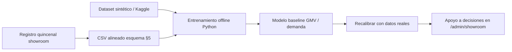

# Funcionalidades, Python e IA — Sabores de la Culebra


**Documento de inventario funcional** del marketplace y del showroom, más el uso de **Python** y técnicas de **IA / ML** en el proyecto.

**Relacionado:** [Requisitos / UC / UML](./Requisitos_Funcionales_NoFuncionales_UseCases_UML.md) · [Admin](./admin.md) · [Variables y Kaggle](./Variables_Decision_Datasets_Kaggle.md) · [Showroom 90 días](./Showroom_Optimizacion_90_Dias.md) · [Otros artículos](./Showroom_Otros_Articulos.md) · [ml/README.md](../ml/README.md)

**Última revisión:** ago-2026.

---

## 1. Funcionalidades del producto (por actor)

### 1.1 Consumidor

| Área | Funcionalidad | Rutas / notas |
|------|---------------|---------------|
| Catálogo | Hub `/tienda`, categorías con imagen, productos, productores | RF-02, RF-15 |
| Home | Bloques «Tienda de la comarca» configurables (CRUD admin) | Hub tiles |
| Compra | Carrito multi-vendor, desglose por productor, envío 6,50 € | RF-03, RF-21, RF-23 |
| Pago | Checkout Stripe (tarjeta/Bizum), split y retención | RF-04…06 |
| Turismo | Alojamientos (reserva externa), packs/cestas | RF-16, RF-17 |
| Cuenta | Pedidos, reviews | RF-08, RF-09 |
| Accesibilidad | Tooltips al hover/foco, `alt` en imágenes, auditoría WAI en admin | RF-28 |

### 1.2 Productor (VENDOR)

| Área | Funcionalidad |
|------|---------------|
| Catálogo | Alta/edición productos, stock, envío a revisión |
| Pedidos | Gestión VendorOrder, marcar enviado + tracking manual |
| Contratos | Aceptación de versiones |
| Liquidaciones | Consulta payouts |

### 1.3 Administrador (ADMIN)

Menú agrupado: Panel · Catálogo · Operaciones · Negocio · Proyecto · Control. **Inventario completo:** [`admin.md`](./admin.md) · manual usuario §A4.

| Sección | Rutas | Funcionalidad |
|---------|-------|---------------|
| Panel | `/admin`, `/admin/config` | Resumen de pendientes; redes; CRUD hub; auditoría WAI |
| Catálogo | `/admin/productores`, `/productos`, `/turismo` | Moderación, comisiones, alojamientos, packs, CRM |
| Operaciones | `/admin/pedidos`, `/contratos`, `/liquidaciones`, `/usuarios` | Pedidos, contratos, payouts, cuentas |
| Negocio | `/admin/kpis`, `/plan`, `/rentabilidad`, `/rappels` | KPIs, riesgos, simulador financiero, rappels |
| Proyecto | `/admin/showroom`, `/showroom/estadisticas`, `/packaging`, `/piloto`, `/raya`, `/entregables-ai`, `/sandbox` | Showroom, **stats + CSV/ML**, packaging, piloto, expediente, pruebas E2E |
| Control | `/admin/auditoria` | Logs de auditoría |

### 1.4 Showroom físico (soporte software)

No es POS: es **playbook + simuladores** para decidir ticket, conversión, impulso, lista de 8, tote y canal alojamientos.

---

## 2. Arquitectura software (resumen)

```text
apps/web          Next.js (UI, admin, auth.js)
packages/auth     Dominio: carrito, checkout, hub, CRM lodging…
packages/db       Prisma + PostgreSQL
packages/domain   Tipos compartidos
ml/               Python: datasets, notebooks, generación sintética
data/synthetic/   CSV sintético showroom (versionable)
data/kaggle/      Datasets descargados (gitignore)
```

Stack principal: **TypeScript / Next.js / Prisma**.  
Análisis predictivo y experimentación: **Python 3.11 + scikit-learn** (fuera del runtime de producción web).

---

## 3. Uso de Python

| Elemento | Descripción |
|----------|-------------|
| Entorno | `.venv` (Python 3.11); deps en `ml/requirements.txt` |
| Activación | `.\.venv\Scripts\Activate.ps1` (Windows) |
| Generador | `ml/generate_culebra_synthetic.py` → `data/synthetic/culebra_showroom_daily.csv` |
| Notebooks | `data/synthetic/culebra_showroom_synthetic_notebook.ipynb` (decisión); Kaggle local en `data/kaggle/` (no versionado) |
| CLI Kaggle | Token en `%USERPROFILE%\.kaggle\access_token` (formato KG…) |
| Librerías | pandas, numpy, scikit-learn, matplotlib, seaborn, jupyter, kaggle, pyarrow, openpyxl |

Python **no** sustituye el backend Node: se usa para **ciencia de datos, prototipado de predicción y documentación de decisión**.

---

## 4. Uso de IA / ML en el proyecto

### 4.1 Qué hay hoy

| Tipo | Qué hace | Dónde |
|------|----------|-------|
| **Simulación determinista** | Calcula GMV, margen, metas 90 días a partir de sliders | `/admin/showroom` (TS) |
| **Métricas de impulso** | Attach, uplift, lista de 8, tote, mini-cata vs metas | `showroom-impulse-metrics` |
| **Dataset sintético** | Replica variables Culebra↔Kaggle con estacionalidad realista | `generate_culebra_synthetic.py` |
| **ML supervisado (offline)** | RandomForest: predecir GMV; clasificar `Demand_Level` | Notebook sintético |
| **EDA / importancia de features** | Gráficos para decidir palancas (ticket, referidos, promo…) | Mismo notebook |
| **Datos públicos** | Retail Forecast 2026, Instacart, hotel booking (mapa) | Doc Variables + Kaggle |
| **Asistente chat (producto)** | Widget conversacional en la web (si activo) | `ChatWidget` |

### 4.2 Qué no es (límites)

- No hay modelo ML **en producción** sirviendo predicciones en tiempo real al checkout.
- Los números del dataset sintético y de Kaggle **no** son ventas reales de Villardeciervos.
- La «IA» del panel showroom es sobre todo **simulación + reglas de negocio**; el RF/notebook prepara el salto a predicción cuando haya histórico real.

### 4.3 Flujo previsto de predicción



---

## 5. Accesibilidad (WAI / WCAG)

- Mensajes al pasar el ratón / foco (`a11y-hint`, `title`, `aria-label`).
- Textos alternativos en imágenes de catálogo y hub.
- Panel de auditoría en `/admin/config` (idioma, `alt`, nombre accesible de enlaces/botones).

---

## 6. Índice rápido de docs operativos

| Tema | Documento |
|------|-----------|
| Requisitos + UML | `Requisitos_Funcionales_NoFuncionales_UseCases_UML.md` |
| Showroom 90 días | `Showroom_Optimizacion_90_Dias.md` |
| Otros artículos / lista 8 / tote | `Showroom_Otros_Articulos.md` |
| Variables → Kaggle | `Variables_Decision_Datasets_Kaggle.md` |
| Alojamientos | `Estrategia_Alojamientos_Rurales.md` |
| CRM hosteleros | `Relaciones_Hosteleros_Contraprestaciones.md` |
| Python setup | `ml/README.md` |

---

*Documento vivo: actualizar al añadir módulos admin o pipelines ML en CI.*
