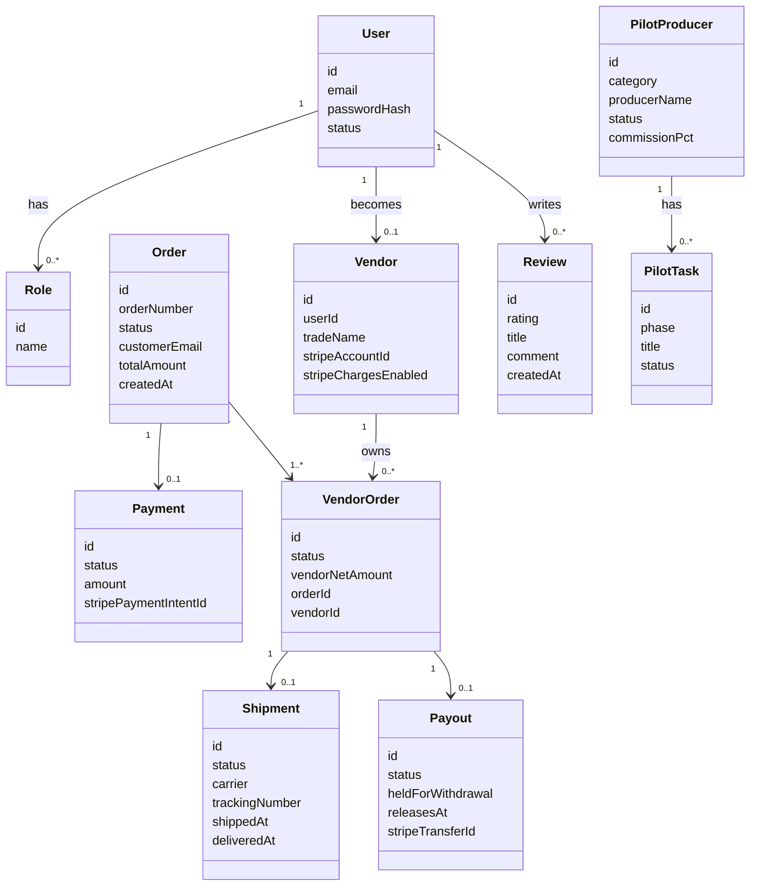
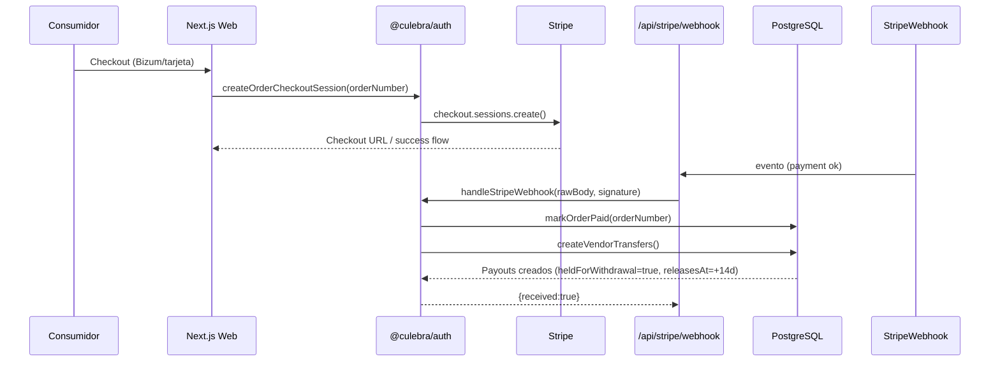
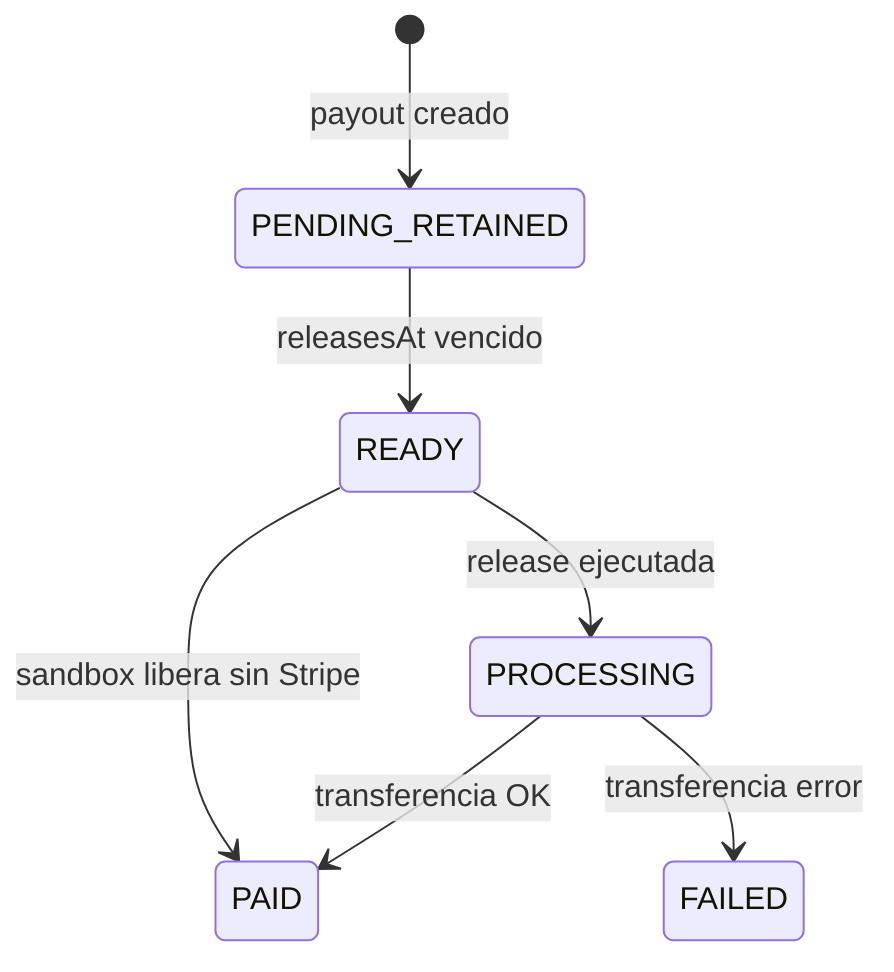

# Requisitos Funcionales / No Funcionales + Casos de Uso + UML

---

## C. Requisitos Funcionales (RF) y No Funcionales (RNF)

### C1. Requisitos Funcionales

RF-01 Autenticación y roles

- El sistema debe soportar login/register y roles: ADMIN, VENDOR, CONSUMER.
- Debe proteger rutas de panel productor y panel admin.

RF-02 Catálogo y categorías

- El consumidor debe poder ver categorías y productos publicados.

RF-03 Carrito multi-proveedor

- El consumidor debe poder añadir productos de diferentes productores.
- El backend debe calcular comisión marketplace y neto por productor.

RF-04 Checkout con Stripe Connect + Bizum

- Debe existir flujo de checkout que habilite tarjeta y Bizum.
- Debe crear sesión Stripe con metadata del pedido.

RF-05 Split funds y retención 14 días (desistimiento)

- El sistema debe crear payouts por `VendorOrder` en estado retenido.
- Debe registrar `releasesAt` y `heldForWithdrawal`.

RF-06 Liberación de payouts

- Debe existir mecanismo (cron/webhook) para liberar payouts cuyo `releasesAt` ha vencido.

RF-07 Emails transaccionales

- Debe enviarse email de confirmación de pedido.
- Debe enviarse email de aviso de envío cuando el productor marca el subpedido como SHIPPED.

RF-08 Shipping y estados de VendorOrder

- El productor debe poder cambiar el estado de VendorOrder siguiendo transiciones válidas.
- Al SHIPPED se crea/actualiza Shipment y se sincroniza el pedido padre.

RF-09 Reviews post-compra

- Debe existir formulario de reviews con validación.
- Debe impedir duplicados por producto dentro de un pedido pagado.

RF-10 Panel Admin de KPIs

- Debe mostrar KPIs con objetivos y niveles de severidad.

RF-11 Panel Rentabilidad

- Debe calcular beneficio neto por transacción con desglose de costes imputables.

RF-12 Panel Rappels

- Debe calcular tramos y rappel teórico por productor en base a facturación anual.

RF-13 Grupo Piloto

- Admin debe gestionar productores piloto con tareas por fase y estados.

RF-14 Sandbox de validación

- Admin debe poder ejecutar simulaciones para validar flujo end-to-end sin Stripe real.

### C2. Requisitos No Funcionales

RNF-01 Seguridad

- Proteger cron con `CRON_SECRET`.
- Verificar autenticación/roles en paneles.
- No exponer secretos en logs.

RNF-02 Robustez ante idempotencia de webhooks

- Webhook debe tolerar reintentos (ej.: `markOrderPaid` no recrea payouts si ya está PAID).

RNF-03 Confidencialidad

- Separación de configuración por entorno.

RNF-04 Observabilidad

- Logs best-effort para emails (no bloquear transacciones).

RNF-05 Rendimiento

- Listados paginados (orders, payouts, etc.).

RNF-06 Cumplimiento legal

- Retención de 14 días aplicada a payouts.

---

## D. Casos de Uso (Use Cases) — Alto nivel

Actores:

- **Consumidor**
- **Productor**
- **Administrador**
- **Sistema** (webhook/cron)

Use cases principales:

- UC-01 Consultar catálogo y categorías
- UC-02 Gestionar carrito multi-vendor
- UC-03 Realizar checkout (Stripe Connect + Bizum)
- UC-04 Confirmación de pago (webhook) → marcar pedido pagado
- UC-05 Crear payouts retenidos (heldForWithdrawal + releasesAt)
- UC-06 Liberar payouts maduros (cron)
- UC-07 Productor confirma y envía pedido (shipping)
- UC-08 Envío de email de shipment
- UC-09 Consumidor deja review post-compra
- UC-10 Admin consulta KPIs y rentabilidad
- UC-11 Admin gestiona grupo piloto
- UC-12 Sandbox: simular pago y shipping para validación

---

## E. Especificación de los flujos más importantes (detalle)

### E1. Checkout → pago OK → split → payouts retenidos

Precondiciones:

- Existe `Order` con `Payment` en `PAYMENT_PENDING`.
- Existe sesión stripe creada con metadata `orderNumber`.

Postcondiciones:

- `Payment.status = PAYMENT_PAID`
- `Order.status = PAID` (si aplica por estados de shipping)
- Se crean `Payout` por cada `VendorOrder` asociado:
  - `heldForWithdrawal = true`
  - `releasesAt = now + 14 días`

Puntos críticos:

- Idempotencia: si el pago ya está PAID no duplicar.
- Webhook: tolerar reintentos y eventos ordenados fuera de secuencia.

### E2. Liberación de payouts al vencimiento de retención

Precondiciones:

- Payouts con `heldForWithdrawal=true` y `releasesAt <= now`.

Postcondiciones:

- Payouts pasan a `heldForWithdrawal=false` y estado final (PAID/FAILED).
- Se ejecuta transfer (real) si Stripe está configurado; en sandbox se simula localmente.

### E3. Shipping: `VendorOrder.SHIPPED` → Shipment + email

Precondiciones:

- Actor: `VENDOR` autenticado y propietario del `VendorOrder`.
- Transición válida (PENDING/CONFIRMED/IN_PREPARATION → SHIPPED).

Postcondiciones:

- `VendorOrder.status = SHIPPED`
- `Shipment.status = SHIPPED`, `shippedAt = now`
- Email best-effort enviado al comprador con tracking.

### E4. Reviews post-compra

Precondiciones:

- Usuario logueado.
- Orden pagada y pertenece al usuario.
- Producto existe en el pedido.
- No existe review previa para ese producto.

Postcondiciones:

- Se crea `Review` con rating + contenido opcional.

### E5. Admin: Rentabilidad por transacción

Precondiciones:

- Existen `Payout` y relación a `VendorOrder`/`Order`.

Postcondiciones:

- KPI por transacción con desglose de:
  - comisión marketplace
  - costes imputables (Stripe processing, amortización, envasado, transporte, cloud/gestoría)
  - beneficio neto y margen.

---

## F. Diagramas UML (los 4 principales + otros útiles)

> Nota: Los diagramas se expresan con Mermaid para integrarlos en documentación.

### F1. Diagrama de clases (estático)



### F2. Diagrama de casos de uso (funcional)

```mermaid
usecaseDiagram
  actor Consumidor
  actor Productor
  actor Administrador
  actor Cron as CronJob
  actor StripeWebhook as StripeWebhook

  Consumidor -- (Consultar catálogo)
  Consumidor -- (Gestionar carrito)
  Consumidor -- (Realizar checkout)
  Consumidor -- (Dejar review)

  Productor -- (Confirmar pedido)
  Productor -- (Marcar envío SHIPPED)
  Productor -- (Marcar entregado)

  Administrador -- (Ver KPIs)
  Administrador -- (Ver rentabilidad)
  Administrador -- (Gestionar rappels)
  Administrador -- (Gestionar grupo piloto)
  Administrador -- (Ejecutar sandbox)

  StripeWebhook -- (Confirmar pago)
  CronJob -- (Liberar payouts maduros)
```

### F3. Diagrama de secuencia (checkout + retención)



### F4. Diagrama de actividades (shipping y email)

```mermaid
flowchart TD
  A[Productor inicia "Enviar"] --> B{VendorOrder estado actual}
  B -->|PENDING| C[updateVendorOrderStatus -> CONFIRMED]
  B -->|CONFIRMED| D[updateVendorOrderStatus -> SHIPPED]
  B -->|IN_PREPARATION| D
  C --> D
  D --> E[Crear/actualizar Shipment: SHIPPED + shippedAt]
  E --> F[Sincronizar estado del pedido padre]
  F --> G[Enviar email de aviso de envío (best-effort)]
  G --> H[Fin]
```

### F5. Diagrama de estados (payout retention)



### F6. Diagrama de despliegue (deployment)

```mermaid
flowchart TB
  subgraph Cliente
    UI[apps/web (Next.js App Router)]
  end
  subgraph Servidor
    API[API routes (webhook/cron/admin)]
    Auth[@culebra/auth (lógica pagos/email/shipping/reviews)]
  end
  subgraph Persistencia
    DB[(PostgreSQL)]
  end
  subgraph Terceros
    Stripe[Stripe Checkout + Connect]
    Email[Proveedor email (Resend/SendGrid/console dev)]
  end

  UI --> API
  API --> Auth
  Auth --> DB
  API --> Stripe
  Auth --> Email
```

### F7. Diagrama de componentes (software)

```mermaid
flowchart LR
  Web[apps/web] --> Auth[@culebra/auth]
  Web --> DB[@culebra/db (Prisma)]
  Auth --> Stripe[Stripe SDK]
  Auth --> Email[Email provider]
  Auth --> Storage[Assets/Storage si aplica]
```

---

## G. Anexos sugeridos (opcional)

- Guía de pruebas end-to-end (incluye sandbox).
- Checklist de despliegue para producción.
- Plantillas de UAT para el Grupo Piloto.

