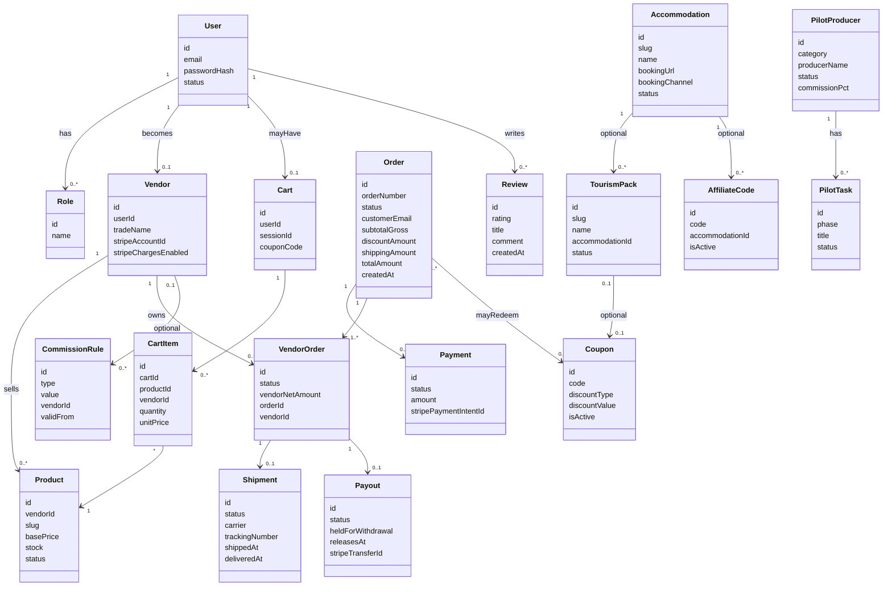
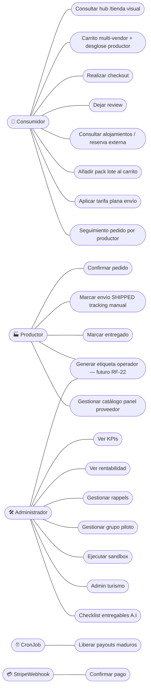
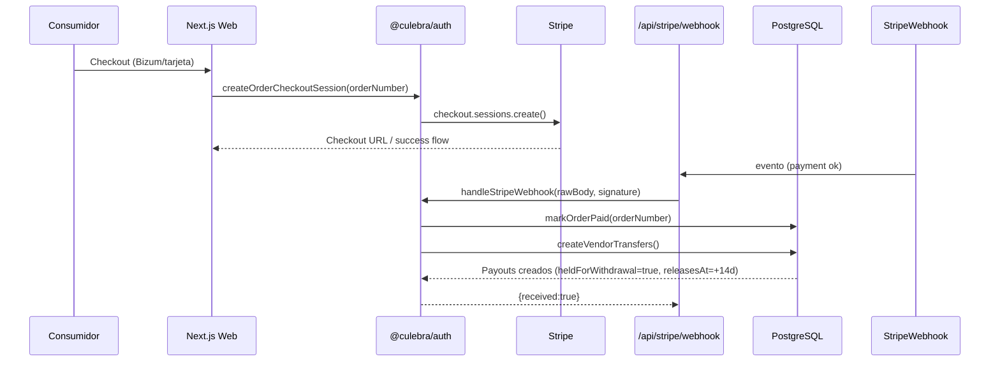
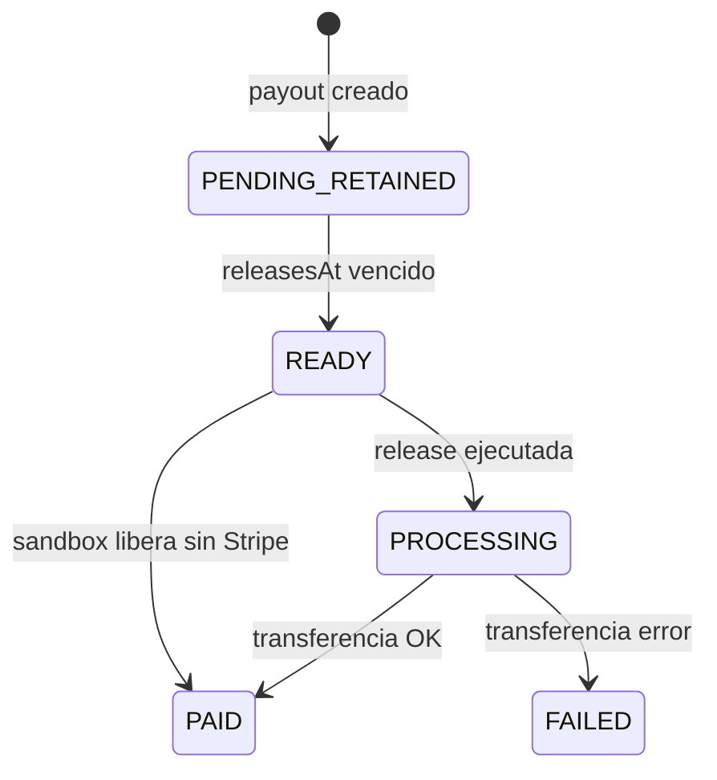
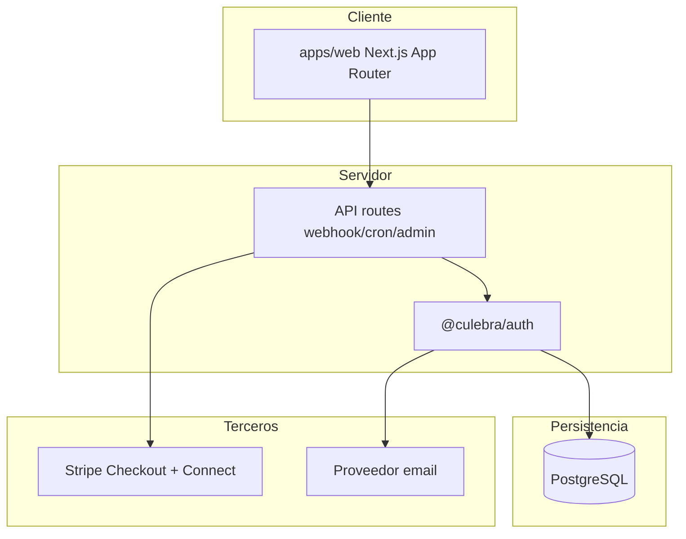
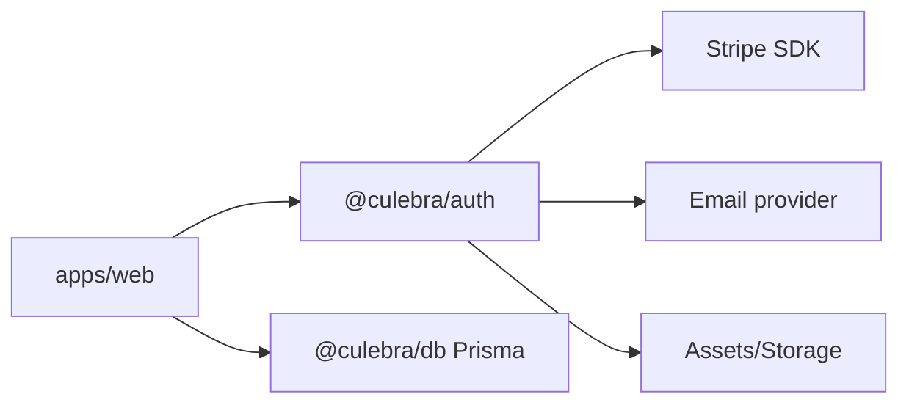
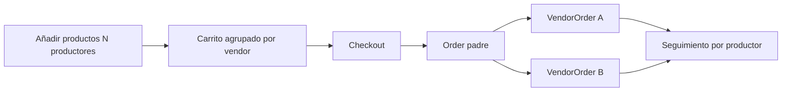

# Requisitos Funcionales / No Funcionales + Casos de Uso + UML


**Documentos relacionados:** [Manual de usuario](./Manual_Usuario_Marketplace.md) · [Manual de desarrollador](./Manual_Desarrollador_Marketplace.md) · [Turismo](./tourism.md) · [Carrito](./cart.md) · [Entregables A.I](./Entregables_Contrato_AI_Nucleo_Marketplace.md) · [Wireframes UI/UX](./Wireframes_UIUX_Contrato_AI.md)

**Última revisión:** ago-2026 — alineación con contrato A.I (núcleo 14.500 €: A.1–A.3 + A.5a), desglose de cesta por productor, hub/tienda visual y checklist `/admin/entregables-ai`.

---

## B. Mapa WBS ↔ requisitos (expediente)

| Partida | Subpartida | Importe | RF / UC principales | Estado software |
|---------|------------|--------:|---------------------|-----------------|
| **A.I** | A.1 Arquitectura, BD, UI/UX | 3.500 € | RF-01, RF-02, RF-15, RF-25 · wireframes | Cumplido (repo) |
| **A.I** | A.2 Catálogo + panel productor | 5.000 € | RF-02, RF-15 · UC-01, UC-21 | Cumplido |
| **A.I** | A.3 Pedidos, carrito, checkout | 4.000 € | RF-03, RF-21, RF-23 · UC-02, UC-03, UC-17, UC-18 | Cumplido |
| **A.I** | A.5a Comisión + admin usable | 2.000 € | RF-10…14, RF-24, RF-26 · UC-10…12, UC-20 | Cumplido |
| **A.II** | A.4 Pagos / retención 14 d | 4.000 € | RF-04…06 · UC-03…06 | Implementado (cierre A.II) |
| **A.II** | A.5b Cierre fino admin | 1.000 € | contratos versionados, rappels, auditoría | Parcial / adelantado |
| **A.II** | A.6 Seguridad y producción | 3.500 € | RNF-01…03, despliegue | En curso / checklist A.II |

Detalle de aceptación técnica A.I: [`Entregables_Contrato_AI_Nucleo_Marketplace.md`](./Entregables_Contrato_AI_Nucleo_Marketplace.md).

---

## C. Requisitos Funcionales (RF) y No Funcionales (RNF)

### C1. Requisitos Funcionales

RF-01 Autenticación y roles

- El sistema debe soportar login/register y roles: ADMIN, VENDOR, CONSUMER.
- Debe proteger rutas de panel productor y panel admin.

RF-02 Catálogo, hub tienda y categorías

- El consumidor debe poder ver el hub `/tienda`, categorías agro y productos publicados.
- Las entradas de turismo/packs en el hub no deben mezclar la reserva de noche en el checkout de productos.
- Las categorías del hub y las tarjetas de categoría deben mostrar **imagen** (foto de producto o placeholder por slug en `/public/categories/`).

RF-03 Carrito multi-proveedor

- El consumidor debe poder añadir productos de diferentes productores.
- El backend debe calcular comisión marketplace y neto por productor.
- El carrito debe mostrar subtotal, descuentos, **envío** (tarifa plana) y total a pagar.
- La UI del carrito debe **agrupar líneas por productor** con subtotal por vendedor (cesta unificada + desglose visible). Ver RF-23.

RF-04 Checkout con Stripe Connect + Bizum

- Debe existir flujo de checkout que habilite tarjeta y Bizum.
- Debe crear sesión Stripe con metadata del pedido.
- El importe de pago debe incluir `shippingAmount` cobrado al cliente (tarifa plana 6,50 € si hay mercancía).

RF-05 Split funds y retención 14 días (desistimiento)

- El sistema debe crear payouts por `VendorOrder` en estado retenido.
- Debe registrar `releasesAt` y `heldForWithdrawal`.

RF-06 Liberación de payouts

- Debe existir mecanismo (cron/webhook) para liberar payouts cuyo `releasesAt` ha vencido.

RF-07 Emails transaccionales

- Debe enviarse email de confirmación de pedido.
- Debe enviarse email de aviso de envío cuando el productor marca el subpedido como SHIPPED.

RF-08 Shipping y estados de VendorOrder

- El productor debe poder cambiar el estado de VendorOrder siguiendo transiciones válidas.
- Al SHIPPED se crea/actualiza `Shipment` y se sincroniza el pedido padre.
- **Estado actual (implementado):** el productor puede **registrar manualmente** `carrier` (texto libre) y `trackingNumber` (texto libre) al marcar SHIPPED desde `/panel/proveedor/pedidos/[id]`. No hay integración con API de transportista.
- **Fuera de alcance actual:** generación automática de etiqueta adhesiva de caja (PDF/ZPL), impresión térmica y alta del envío en Correos/SEUR/otro. Ver RF-22.

RF-09 Reviews post-compra

- Debe existir formulario de reviews con validación.
- Debe impedir duplicados por producto dentro de un pedido pagado.

RF-10 Panel Admin de KPIs

- Debe mostrar KPIs con objetivos y niveles de severidad.

RF-11 Panel Rentabilidad

- Debe calcular beneficio neto por transacción con desglose de costes imputables.

RF-12 Panel Rappels

- Debe calcular tramos y rappel por productor en base a facturación anual; al cierre del año natural congela liquidaciones `RappelSettlement` (pendiente de abono → abonado).

RF-13 Grupo Piloto

- Admin debe gestionar productores piloto con tareas por fase y estados.

RF-14 Sandbox de validación

- Admin debe poder ejecutar simulaciones para validar flujo end-to-end sin Stripe real.

RF-15 Hub tienda de la comarca

- Debe existir `/tienda` que agrupe categorías agroalimentarias y entradas a turismo/packs.
- `/categorias` (índice) puede redirigir al hub; las fichas `/categorias/[slug]` siguen siendo catálogo agro.
- El hub debe transmitir sensación de **escaparate** (hero/mosaico de producto + tiles con imagen), no un listado textual frío.

RF-16 Directorio de alojamientos (fase 2)

- Debe listar alojamientos publicados con enlace de reserva externa (Booking, web, WhatsApp, teléfono, email).
- Debe permitir cross-sell producto ↔ alojamiento sin integrar la noche en el checkout.

RF-17 Packs territoriales (fase 3)

- Debe permitir packs “noche + lote gourmet”: el lote se añade al carrito como productos; la noche permanece como enlace externo al alojamiento.

RF-18 Cupones

- Debe poder aplicarse un cupón al carrito (% o fijo) con validación de vigencia y mínimo de pedido.
- El descuento se refleja en `Order.discountAmount` / `Order.couponCode` y en el importe de pago.

RF-19 Afiliación

- Debe capturar `?ref=CODIGO`, persistirlo (cookie) y asociarlo al pedido (`Order.affiliateCode`) si el código está activo.

RF-20 Admin turismo

- Admin debe poder gestionar alojamientos, packs, cupones y códigos de afiliado desde `/admin/turismo`.

RF-21 Tarifa plana de envío (logística)

- Si el merchandise del pedido (subtotal − cupón) es **&gt; 0**, el cliente paga **6,50 €** de envío (`Order.shippingAmount`).
- **No hay envío gratis** ni absorción de portes por el marketplace.
- Comisión por defecto **17 %** con mínimo **4 €** por subpedido de productor (`DEFAULT_MIN_COMMISSION_EUR`).
- La UI debe mostrar la tarifa plana (sin mensaje de “te faltan X para envío gratis”).
- Constantes de dominio: `CUSTOMER_SHIPPING_FEE_EUR`, `DEFAULT_MARKETPLACE_COMMISSION_PERCENT`, `DEFAULT_MIN_COMMISSION_EUR`.

RF-22 Etiqueta logística de caja e integración con operador (pendiente de operador)

> Circunstancia documentada (ago-2026): **aún no se ha seleccionado operador logístico**. El dossier (§14.2) describe el objetivo operativo; el software **no** elabora todavía la etiqueta adhesiva de la caja.

**Implementado hoy**

- Cobro de portes al cliente (RF-21).
- Datos de envío del pedido (dirección).
- Registro manual de transportista + tracking al marcar SHIPPED (RF-08).
- Email de aviso de envío con tracking si se informó (RF-07).
- PDF resumen de pedido / subpedido (justificante interno; **no** es la etiqueta del mensajero).
- Acceso: productor en `/panel/proveedor/pedidos` → detalle `/panel/proveedor/pedidos/[id]`. Admin consulta en `/admin/pedidos` (sin generar etiqueta carrier).

**No implementado (requisito futuro, tras contrato con operador)**

- Conexión API/portal del transportista (Correos, SEUR u otro).
- Generación automática de etiqueta adhesiva exterior (código de barras / tracking del carrier).
- Botón “Imprimir etiqueta” hacia impresora térmica en trastienda Villardeciervos.
- Flujo de consolidación logística centralizado (puesto de embalaje S.L.) distinto del panel por productor, si se confirma el modelo de consolidación del dossier.

**Workaround operativo hasta la integración**

1. Preparar la caja en trastienda.
2. Crear el envío en el portal web del transportista elegido.
3. Imprimir su etiqueta.
4. Copiar el número de seguimiento en el panel del pedido (RF-08).

El modelo Prisma `Shipment` queda preparado (`carrier`, `trackingNumber`, estados) con comentario de *future carrier integration*.

RF-23 Desglose por productor (cesta y pedido) — A.3

- En `/carrito`, las líneas deben agruparse por `vendorId` mostrando nombre del productor y subtotal del grupo.
- En `/pedido/[orderNumber]`, el seguimiento debe desglosarse por `VendorOrder` (estados por productor).
- El checkout debe crear un `VendorOrder` por productor distinto (`checkout.service`).
- Un solo envío consolidado / tarifa plana al cliente aunque haya varios productores (RF-21).

RF-24 Comisión marketplace y panel admin núcleo — A.5a

- Debe existir regla de comisión por defecto (17 % + mínimo 4 €) y soporte de `CommissionRule` versionado.
- El panel `/admin` debe permitir gestionar productores, productos, pedidos, liquidaciones y consultar comisión por productor.
- **Fuera de A.5a (A.5b):** cierre contractual legal definitivo y moderación avanzada; no bloquea el panel usable.

RF-25 Identidad visual de escaparate (home, tienda, admin)

- Home, `/tienda` y resumen `/admin` deben usar mosaico/imágenes de producto (categorías) para transmitir que se opera una **tienda** de territorio, no un panel genérico.
- Placeholders centralizados en `apps/web/src/lib/category-images.ts`.

RF-26 Checklist entregables contrato A.I

- Admin debe poder abrir `/admin/entregables-ai` con el estado de A.1 / A.2 / A.3 / A.5a y enlaces a rutas de verificación.
- La documentación de aceptación vive en `docs/Entregables_Contrato_AI_Nucleo_Marketplace.md` y wireframes en `docs/Wireframes_UIUX_Contrato_AI.md`.

### C2. Requisitos No Funcionales

RNF-01 Seguridad

- Proteger cron con `CRON_SECRET`.
- Verificar autenticación/roles en paneles.
- No exponer secretos en logs.

RNF-02 Robustez ante idempotencia de webhooks

- Webhook debe tolerar reintentos (ej.: `markOrderPaid` no recrea payouts si ya está PAID).

RNF-03 Confidencialidad

- Separación de configuración por entorno.

RNF-04 Observabilidad

- Logs best-effort para emails (no bloquear transacciones).

RNF-05 Rendimiento

- Listados paginados (orders, payouts, etc.).

RNF-06 Cumplimiento legal

- Retención de 14 días aplicada a payouts.

RNF-07 Separación checkout agro / reserva turística

- La reserva de alojamiento no debe mezclarse en el mismo checkout de productos (evita complejidad legal/pago de estancias y mantiene el núcleo agroalimentario del expediente).

RNF-08 Transparencia de portes

- El importe de envío cobrado al cliente (tarifa plana) debe ser visible antes de confirmar el pago (carrito y checkout).
- Debe quedar claro que **no** hay envío gratis ni absorción de portes por la S.L.

RNF-09 Desacoplamiento del operador logístico

- Mientras no haya operador contratado, el sistema no debe hardcodear un carrier concreto en la lógica de negocio.
- La integración de etiquetas (RF-22) será un módulo sustituible por operador (API/credenciales por entorno).

RNF-10 Trazabilidad de entregables WBS

- Los entregables de software del núcleo deben poder mapearse a partidas A.I / A.II (contrato menor ≤ 15.000 € por servicio).
- Evidencias: repositorio, docs de entregables, Cuaderno de ejecución, panel `/admin/entregables-ai`.

RNF-11 Experiencia de tienda (no dashboard frío)

- Las superficies de catálogo y el resumen admin deben incluir ancla visual de producto (imágenes reales o placeholders de categoría).
- Tipografía y layout coherentes con [`ux.md`](./ux.md) y wireframes A.1.

RNF-12 Entorno técnico reproducible

- El entorno común (Docker / seed / docs `architecture` + `database`) debe permitir levantar el marketplace multi-vendedor de forma reproducible (criterio A.1).

---

## D. Casos de Uso (Use Cases) — Alto nivel

Actores:

- **Consumidor**
- **Productor**
- **Administrador**
- **Sistema** (webhook/cron)
- **Alojamiento / afiliado** (actor externo; recibe tráfico vía `?ref=` o directorio)

Use cases principales:

- UC-01 Consultar catálogo y hub `/tienda` (tiles con imagen / escaparate)
- UC-02 Gestionar carrito multi-vendor (cupón, tarifa plana, **agrupación por productor**)
- UC-03 Realizar checkout (Stripe Connect + Bizum; cupón/afiliado/envío; split `VendorOrder`)
- UC-04 Confirmación de pago (webhook) → marcar pedido pagado
- UC-05 Crear payouts retenidos (heldForWithdrawal + releasesAt)
- UC-06 Liberar payouts maduros (cron)
- UC-07 Productor confirma y envía pedido (shipping operativo; **tracking manual**)
- UC-08 Envío de email de shipment
- UC-09 Consumidor deja review post-compra
- UC-10 Admin consulta KPIs y rentabilidad
- UC-11 Admin gestiona grupo piloto
- UC-12 Sandbox: simular pago y shipping para validación
- UC-13 Consultar directorio de alojamientos y abrir reserva externa
- UC-14 Añadir pack (lote) al carrito y reservar noche fuera
- UC-15 Aplicar cupón / registrar afiliado en pedido
- UC-16 Admin gestiona turismo (alojamientos, packs, cupones, afiliados)
- UC-17 Calcular y aplicar tarifa plana de envío (6,50 €; sin gratuidad) — en diagrama F2: elipse `UC18`
- UC-18 Ver seguimiento de pedido **por productor** (`/pedido/[orderNumber]`)
- UC-19 Generar/imprimir etiqueta de caja vía operador logístico (**futuro**; RF-22; pendiente de elegir operador)
- UC-20 Admin consulta checklist entregables A.I (`/admin/entregables-ai`)
- UC-21 Productor gestiona catálogo propio (productos, precios, stock) en `/panel/proveedor`

---

## E. Especificación de los flujos más importantes (detalle)

### E1. Checkout → pago OK → split → payouts retenidos

Precondiciones:

- Existe `Order` con `Payment` en `PAYMENT_PENDING`.
- Existe sesión stripe creada con metadata `orderNumber`.

Postcondiciones:

- `Payment.status = PAYMENT_PAID`
- `Order.status = PAID` (si aplica por estados de shipping)
- Se crean `Payout` por cada `VendorOrder` asociado:
  - `heldForWithdrawal = true`
  - `releasesAt = now + 14 días`

Puntos críticos:

- Idempotencia: si el pago ya está PAID no duplicar.
- Webhook: tolerar reintentos y eventos ordenados fuera de secuencia.

### E2. Liberación de payouts al vencimiento de retención

Precondiciones:

- Payouts con `heldForWithdrawal=true` y `releasesAt <= now`.

Postcondiciones:

- Payouts pasan a `heldForWithdrawal=false` y estado final (PAID/FAILED).
- Se ejecuta transfer (real) si Stripe está configurado; en sandbox se simula localmente.

### E3. Shipping: `VendorOrder.SHIPPED` → Shipment + email

Precondiciones:

- Actor: `VENDOR` autenticado y propietario del `VendorOrder`.
- Transición válida (PENDING/CONFIRMED/IN_PREPARATION → SHIPPED).
- Acceso UI: `/panel/proveedor/pedidos/[id]`.

Datos de entrada (estado actual):

- `carrier` (opcional, texto libre; ej. “Correos”, “SEUR”).
- `trackingNumber` (opcional, texto libre).

Postcondiciones:

- `VendorOrder.status = SHIPPED`
- `Shipment` creado/actualizado: `status = SHIPPED`, `shippedAt = now`, `carrier` / `trackingNumber` si se informaron
- Email best-effort al comprador con tracking si existe

**Limitación explícita:** este flujo **no** genera ni imprime la etiqueta adhesiva del transportista. Ver E9 / RF-22.

### E4. Reviews post-compra

Precondiciones:

- Usuario logueado.
- Orden pagada y pertenece al usuario.
- Producto existe en el pedido.
- No existe review previa para ese producto.

Postcondiciones:

- Se crea `Review` con rating + contenido opcional.

### E5. Admin: Rentabilidad por transacción

Precondiciones:

- Existen `Payout` y relación a `VendorOrder`/`Order`.

Postcondiciones:

- KPI por transacción con desglose de:
  - comisión marketplace
  - costes imputables (Stripe processing, amortización, envasado, transporte, cloud/gestoría)
  - beneficio neto y margen.

### E6. Pack + reserva externa (sin mezclar checkout)

Precondiciones:

- Pack publicado con ítems de producto `PUBLISHED`.
- Alojamiento publicado (opcional) con `bookingUrl` / canal de reserva.

Flujo:

1. Consumidor en `/packs/[slug]` añade el **lote** al carrito (`addPackToCart`).
2. Si el pack tiene cupón asociado, se intenta aplicar al carrito.
3. Consumidor abre el enlace de reserva del alojamiento (fuera del marketplace).
4. Checkout del carrito cobra productos (+ descuento cupón si aplica) **y** el envío según tarifa plana (RF-21).

Postcondiciones:

- Pedido con líneas de producto; sin línea de “noche”.
- Si había `?ref=`, `Order.affiliateCode` informativo.

### E7. Cupón en carrito → pedido

Precondiciones:

- Cupón activo, dentro de fechas, bajo `maxRedemptions`, y subtotal ≥ `minOrderAmount`.

Postcondiciones:

- `Cart.couponCode` / `Order.couponCode`, `Order.discountAmount`.
- `Payment.amount` = merchandise tras descuento **+** `shippingAmount`.
- `CouponRedemption` + incremento de `redemptionCount`.

### E8. Tarifa plana de envío

Precondiciones:

- Carrito con al menos una línea de producto.

Regla (`computeShippingQuote`):

| Merchandise (subtotal − cupón) | `Order.shippingAmount` |
|--------------------------------|-----------------------:|
| &gt; 0 € | 6,50 € (tarifa plana) |
| 0 € | 0 € |

Postcondiciones:

- `Order.totalAmount` = merchandise + `shippingAmount`.
- La S.L. **no** absorbe portes; el cliente paga siempre la tarifa.
- UI: muestra tarifa plana (sin progreso hacia envío gratis).

### E9. Etiqueta de caja e integración con operador (futuro — RF-22 / UC-19)

Precondiciones (cuando se active):

- Operador logístico seleccionado y contrato/credenciales configurados.
- Pedido pagado con dirección de envío completa.
- Puesto de embalaje (productor o consolidación S.L. en Villardeciervos) autenticado.

Flujo objetivo:

1. Usuario solicita “Generar etiqueta” desde el panel de pedido / pantalla de consolidación.
2. El sistema crea el envío en la API/portal del operador.
3. Se obtiene tracking + fichero de etiqueta (PDF/ZPL).
4. Se actualiza `Shipment.carrier` / `Shipment.trackingNumber`.
5. Se permite imprimir en impresora térmica local.

Postcondiciones:

- Etiqueta imprimible del carrier asociada al `VendorOrder` / envío consolidado.
- Cliente puede seguir el tracking (email / ficha de pedido).

**Estado hoy:** no implementado; workaround = portal del transportista + copiar tracking (RF-08).

### E10. Carrito multi-vendor con desglose por productor (RF-23 / UC-02)

Precondiciones:

- Carrito con líneas de ≥ 1 productor (idealmente ≥ 2 para validar desglose).

Flujo:

1. Consumidor añade productos desde fichas distintas.
2. En `/carrito` ve secciones por productor + subtotal de cada grupo.
3. Totales globales: merchandise, cupón, envío plano, grand total.
4. Checkout genera un `VendorOrder` por `vendorId`.

Postcondiciones:

- UI muestra desglose; persistencia con `CartItem` → líneas de pedido por productor.

### E11. Checklist entregables A.I (RF-26 / UC-20)

Precondiciones:

- Actor ADMIN autenticado.

Flujo:

1. Abrir `/admin/entregables-ai`.
2. Revisar bloques A.1 / A.2 / A.3 / A.5a y enlaces de verificación.
3. Completar acta en `Entregables_Contrato_AI_Nucleo_Marketplace.md` §6 (Cuaderno).

Postcondiciones:

- Evidencia de revisión técnica del núcleo (sin sustituir factura/pago).

---

## F. Diagramas UML (los 4 principales + otros útiles)

> Nota: Los diagramas se expresan con Mermaid para integrarlos en documentación.

### F1. Diagrama de clases (estático)

> `Shipment.carrier` / `trackingNumber` se rellenan hoy a mano (RF-08). La generación de etiqueta del operador (PDF/ZPL) es **RF-22 / UC-19**.



### F2. Diagrama de casos de uso (funcional)



### F3. Diagrama de secuencia (checkout + retención)



### F4. Diagrama de actividades (shipping y email)

```mermaid
flowchart TD
  A[Productor inicia "Enviar"] --> B{VendorOrder estado actual}
  B -->|PENDING| C[updateVendorOrderStatus -> CONFIRMED]
  B -->|CONFIRMED| D[updateVendorOrderStatus -> SHIPPED]
  B -->|IN_PREPARATION| D
  C --> D
  D --> E[Crear/actualizar Shipment: SHIPPED + shippedAt]
  E --> F[Sincronizar estado del pedido padre]
  F --> G[Enviar email de aviso de envío (best-effort)]
  G --> H[Fin]
```

### F5. Diagrama de estados (payout retention)



### F6. Diagrama de despliegue (deployment)



### F7. Diagrama de componentes (software)



### F8. Flujo cesta unificada → desglose por productor (A.3)



---

## G. Anexos sugeridos (opcional)

- Guía de pruebas end-to-end (incluye sandbox).
- Checklist de despliegue para producción.
- Plantillas de UAT para el Grupo Piloto.
- Acta interna A.I: [`Entregables_Contrato_AI_Nucleo_Marketplace.md`](./Entregables_Contrato_AI_Nucleo_Marketplace.md) §6.
- Wireframes: [`Wireframes_UIUX_Contrato_AI.md`](./Wireframes_UIUX_Contrato_AI.md).
