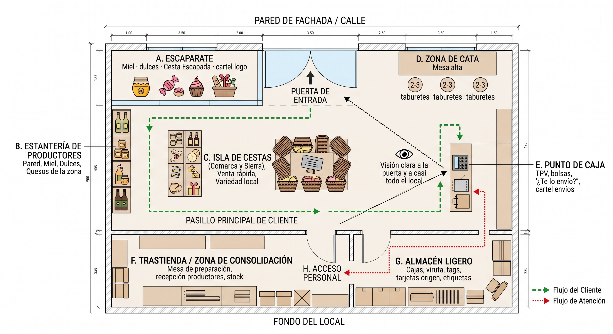

# Showroom — alternativa con local en propiedad de la S.L.

**Marketplace Sabores de la Culebra – Villardeciervos**  
Documento de **alternativa** al escenario base (comodato). No sustituye el concepto operativo de [`Concepto_Tienda_Showroom_Villardeciervos.md`](./Concepto_Tienda_Showroom_Villardeciervos.md) ni el playbook de ingresos [`Showroom_Ingresos_Cestas.md`](./Showroom_Ingresos_Cestas.md).  
**Plano de referencia:** [`imagenes/plano_showroom.jpg`](./imagenes/plano_showroom.jpg) (raíz: `planoShowRoom.jpg`).

---

## 0. Decisión societaria

| Escenario | Titularidad del local | Uso en expediente |
|-----------|----------------------|-------------------|
| **Base (vigente en plan)** | Comodato / cesión | Acondicionamiento **ligero** + mobiliario/equipamiento; obra civil relevante **excluida** o muy restringida |
| **Alternativa A (este documento)** | **Local en propiedad de la S.L.** | Mejora la elegibilidad de acondicionamiento y, en su caso, obras necesarias **vinculadas a la actividad**; sigue sin subvencionarse el showroom “entero” ni el stock |

**Regla:** el showroom **no se presenta como tienda de alimentación independiente**. Se presenta como **oficina técnica + escaparate de territorio + trastienda de consolidación logística** del marketplace, **centro de trabajo propio** en municipio de **La Raya (Villardeciervos)**.

**Conclusión operativa:** si hay vía real de compra o aportación del local/solar a la S.L., priorizarla frente al comodato: más obra defendible, menos riesgo de recorte y mejor relato institucional.

---

## 1. Principios de diseño (1 persona – Socio 2)

1. Una sola persona controla el espacio sin perder de vista la **puerta** y la zona de clientes.  
2. El cliente entra, ve, prueba y compra **sin cruzar** la zona de trabajo.  
3. Separación clara **pública (venta)** / **operativa (consolidación)**.  
4. Circulación simple, pasillo principal ≥ **1,10 m**.  
5. Visibilidad total desde el **punto de caja (E)**.

---

## 2. Zonas (alineadas al plano)

| Zona | Función | Tamaño orientativo | Fase |
|------|---------|-------------------|:----:|
| **A. Escaparate / entrada** | Primera impresión; impulso (miel, dulces, Cesta Escapada); logo + claim | 1,5–2 m lineales | 1 |
| **B. Estantería productores** | Módulos por productor (foto, pueblo, 3–5 referencias); precios claros | Pared lateral | 1 |
| **C. Isla / mesa de cestas** | Escapada / Comarca / Sierra montadas; venta rápida | Centro ≈ 1,20 × 0,80 m | 1 |
| **D. Zona de cata** | Mesa alta + 2–3 taburetes; uso puntual | 1,20–1,50 m lineales | 2 |
| **E. Punto de caja** | TPV/tablet, bolsas kraft, «¿Te lo envío?» | Mostrador 1,00–1,40 m | 1 |
| **F. Trastienda / consolidación** | Recepción productores, picking, mesa de trabajo, stock mínimo | ≥ 2,0 × 2,5 m | 1 |
| **G. Almacén ligero** | Cajas, viruta, tags, tarjetas (consumible ≠ inversión E) | Fondo trastienda | 1–2 |
| **H. Acceso personal** | Paso staff showroom ↔ trastienda (en el plano) | Puerta interna | 1 |

**Medidas locales (piloto rural):** ancho útil 3,5–4,5 m; fondo 6–9 m (el plano esquemático puede adaptarse a la parcela real). Si el local es más estrecho: unificar isla C + cata D y pegar estanterías a pared.

### Flujo de atención (una persona)

Cliente entra → saludo desde **E** → recorrido **B + C** → cata **D** si procede → cobro en **E** → si es envío, preparación **después** en **F/G**. Sin clientes: consolidar pedidos online, reponer y montar cestas.

---

## 3. Diferencia clave: comodato vs propiedad de la S.L.

Si el **local / solar es propiedad de la S.L.**, el expediente **mejora bastante**.

| Situación | Obra civil y acondicionamiento |
|-----------|--------------------------------|
| **Comodato / alquiler (no propiedad)** | Solo se admite el **mero acondicionamiento** y con **límites de cuantía** (en ICECYL suele limitarse al **50 %** de la suma de bienes de equipo + bienes materiales e inmateriales). **Obra civil relevante → muy difícil o excluida.** |
| **Propiedad de la S.L.** | La obra civil y el acondicionamiento pasan a ser **mucho más defendibles** y pueden entrar como gasto subvencionable **normal** (dentro de los módulos y límites de la convocatoria). En la práctica **desaparece** la camisa de fuerza del “mero acondicionamiento” en local ajeno. |

### 3.1 Qué se abre si es propiedad de la S.L.

**Acondicionamiento completo del local (defendible como necesario):**

- Distribución interior (tabiques; zonas showroom / trastienda / caja según el plano).  
- Electricidad y puntos de red.  
- Iluminación (incl. técnica sobre producto y zona de trabajo).  
- Climatización básica.  
- Suelos, pintura, techos.  
- Adecuación de aseos si hace falta.  
- Seguridad básica.

**Obra civil vinculada al proyecto:**

- Reforma interior orientada a la actividad (**oficina + showroom + zona de consolidación**).  
- Posibles mejoras de acceso o escaparate (**según módulos** de la convocatoria).

**Mayor porcentaje y cuantía elegible:**

- Al no aplicar la restricción de “local ajeno”, se puede justificar **más inversión** en el espacio físico.  
- Siguen existiendo **módulos de coste por m²** y límites generales, pero el **techo es más alto**.

**Mejor encaje del relato:**

- El showroom se presenta como **centro de trabajo propio** de la S.L. en Villardeciervos (muy alineado con La Raya e ICECYL).

### 3.2 Lo que sigue sin cambiar

| Regla | Detalle |
|-------|---------|
| Necesidad y plazo | Los gastos deben ser **necesarios** para el proyecto y estar dentro del **plazo de ejecución**. |
| Exclusiones | Elementos **decorativos puros**, **gastos corrientes**, **stock**, etc. |
| IVA | El **IVA recuperable** no es subvencionable. |
| Contrato menor | Si el gasto supera el umbral → **3 ofertas**. |
| La Raya L1 | Sigue siendo **complemento** de lo que apruebe el **ICECYL** primero. |
| Software | El grueso defendible del paquete sigue siendo el **desarrollo tecnológico** (A.I + A.II = 23.000 € en el marco 30 k€). |

### 3.3 Resumen rápido

| Pregunta | Respuesta |
|----------|-----------|
| ¿Es mejor que sea propiedad de la S.L.? | **Sí.** |
| ¿Se puede subvencionar más obra y acondicionamiento? | **Sí** (más cuantía y mejor defensa). |
| ¿Desaparece el límite de “mero acondicionamiento”? | **En la práctica, sí** (pasa a régimen normal de obra civil / acondicionamiento, dentro de módulos). |
| ¿Sigue haciendo falta que ICECYL lo acepte primero? | **Sí.** La Raya complementa después. |

### 3.4 Cómo poner el inmueble a nombre de la S.L. (opciones habituales)

Si existe posibilidad real de que el local/solar pase a la sociedad, es **claramente más interesante** de cara a la subvención: partida de acondicionamiento/reforma más ambiciosa, relato de centro de trabajo en La Raya, menos riesgo de recorte de obra.

| Vía | Nota |
|-----|------|
| La S.L. **compra** el local | Documentar escritura, pago y titularidad en el expediente. |
| Un socio **aporta el inmueble al capital** | Con **tasación**; queda como activo de la sociedad. |
| Se **adquiere antes de finalizar el plazo de ejecución** | Hay que **declararlo** y que quede recogido en la resolución / justificación. |

La **adquisición del inmueble** (precio de compra) suele ser un capítulo distinto al paquete de **inversión tecnológica + acondicionamiento** (30 k€ del plan); no confundir “comprar el local” con la partida D de reforma.

**Cadena de ayudas:** ICECYL (creación de empresas) → Diputación Zamora **La Raya Línea 1** (hasta **74 %** sobre lo elegible).

---

## 4. Partidas de gasto a incluir (maximizar aceptación)

### 4.0 Dos intensidades de partida D

| Intensidad | Titularidad | Alcance de D (acondicionamiento / obra) |
|------------|-------------|----------------------------------------|
| **Base plan (2.500 €)** | Comodato o aún no hay propiedad | Mero acondicionamiento ligero; respetar límite tipo **50 %** bienes de equipo + materiales/inmateriales si aplica |
| **Alternativa A (ambiciosa)** | **Propiedad S.L.** | Acondicionamiento completo + reforma interior necesaria (tabiques, instalaciones, suelos, techos, aseos, seguridad, escaparate/acceso según módulos). **Cuantía a fijar** con presupuesto de obra y módulos ICECYL; puede superar 2.500 € si se aumenta capital o el total de inversión |

Mantener el **marco 30.000 €** del plan (§3.A / memoria §25.2) como referencia del piloto tecnológico. Si la Alternativa A exige más obra, preferible **ampliar inversión total** (aportación socios) antes que **recortar A.I/A.II**.

### 4.1 Qué meter en la memoria (elegible / a confirmar)

| Código plan | Qué describir en memoria | Ejemplos concretos del plano | Importe orientativo |
|-------------|--------------------------|------------------------------|--------------------:|
| **A.I + A.II** | Marketplace (núcleo + pagos/seguridad) | Canal online + TPV/tablet que registra venta showroom | **23.000 €** |
| **B** | Equipamiento informático del **centro de trabajo** | Portátil/tablet de caja, NAS, pantallas | **2.000 €** |
| **C** | Red y ciberseguridad | Router, firewall, SAI, cableado de puntos de red en E/F | **1.500 €** |
| **D** | Adecuación / obra del **espacio operativo** | Ver §3.1 (pintura, electricidad, red, iluminación, climatización, tabiques showroom/trastienda, suelos, techos, aseos, seguridad, escaparate) | **2.500 €** (base) o **presupuesto de obra** si Alternativa A |
| **E** | Logística ligera + puestos | Mostrador/mesa trabajo, báscula, impresora etiquetas, estantería de consolidación | **1.000 €** |

### 4.2 Qué NO meter (o fuera de ayuda)

| Concepto | Motivo |
|----------|--------|
| Compra de stock / género | No elegible + rompe el modelo |
| Cajas, viruta, tags, lazos (consumible) | Gasto corriente / lanzamiento; **no** mezclar con E |
| Alquiler, luz, sueldos, RETA | Corriente |
| Decoración ornamental (cuadros, objetos sin uso operativo) | Excluible (La Raya / bases) |
| “Tienda gourmet” como objeto principal | Debilita el expediente frente a marketplace + hub logístico |
| Obra de lujo / sanitarios industriales tipo obrador | Innecesaria y riesgosa (no sois envasadores) |
| IVA recuperable | No subvencionable |

### 4.3 Alternativa A — cómo usar la propiedad sin debilitar el software

1. **No reasignar** euros desde A.I/A.II hacia obra: el software sigue siendo el gasto más fácil de defender.  
2. Con propiedad, **sí** se puede incluir una partida **D más ambiciosa** (reforma + acondicionamiento completo) con presupuesto de contratista y, si supera umbral de contrato menor, **3 ofertas**.  
3. Si se sube D: **aumentar capital / inversión total**, no vaciar el marketplace.  
4. Mobiliario de exposición (estanterías B, mesa C, taburetes D, mostrador E) → **E** o suministro de activo fijo nuevo, conceptos **operativos** (“puesto de consolidación”, “mesa de preparación de lotes”, “mostrador de atención y registro de pedidos”), no “decoración comercial”.  
5. Declarar la titularidad del inmueble en solicitud y resolución; si la compra/aportación ocurre en plazo de ejecución, **dejar constancia documental**.

---

## 5. Redacción concreta para memorias (copiar / adaptar)

### 5.1 Definición del espacio (ICECYL + La Raya)

> El centro de trabajo de la sociedad se ubica en **Villardeciervos (Zamora)**, municipio del ámbito territorial del **Plan de La Raya**. El inmueble / solar es **propiedad de la S.L.** [completar: compra / aportación de socio con tasación / adquisición en plazo de ejecución]. Al tratarse de bien propio, la sociedad puede acometer **acondicionamiento y obra civil necesarios** para la actividad (distribución interior, instalaciones, iluminación, climatización básica, suelos, techos, aseos y seguridad), dentro de los módulos y límites de la convocatoria ICECYL, **sin** la restricción de “mero acondicionamiento” aplicable a locales ajenos. En él se implantará un **nodo físico del marketplace** *Sabores de la Culebra* con tres funciones inseparables:
>
> 1. **Oficina técnica** de la plataforma digital (administración, supervisión de catálogo, atención a productores y justificación de ayudas).  
> 2. **Escaparate / showroom de territorio**: exposición de productos de productores adheridos en régimen de **depósito / consignación**, sin compra de stock por la S.L., orientado a generar confianza, captar visita turística y rural, y convertir la prueba física en pedido (venta inmediata o «te lo envío» con porte a cargo del cliente).  
> 3. **Trastienda de consolidación logística**: recepción de mercancía ya envasada por el productor, picking multiproductor, embalaje exterior y etiquetado de envío, sin manipulación del alimento.
>
> El espacio **no** se configura como obrador, tienda tradicional de alimentación ni almacén industrial. La responsabilidad sanitaria del producto envasado permanece en el productor autorizado; la S.L. actúa como intermediario tecnológico y de paquetería limpia.

### 5.2 Justificación de necesidad (por qué no es “decoración”)

> La implantación física es **necesaria** para el modelo de negocio: (i) reduce la barrera de confianza del consumidor urbano ante productores rurales; (ii) permite la **consolidación en un solo envío** de pedidos multi-vendedor, ventaja competitiva frente a agregadores puramente digitales; (iii) concentra en Villardeciervos el centro de trabajo exigido por las ayudas de creación de empresa y por el complemento provincial de La Raya; (iv) puede ser atendido por **una persona** (Socio 2), con control visual de la puerta desde el punto de registro de pedidos.

### 5.3 Zonificación (resumen para memoria — sin vender “interiorismo”)

> El local se organiza en zonas operativas: escaparate de atracción; estantería por productor; isla de lotes/cestas preparados; rincón de cata ligera (fase 2); punto de registro/cobro con TPV o tablet conectada al marketplace; trastienda de consolidación; almacén ligero de material de embalaje. La circulación separa al cliente de la zona de preparación. El plano de implantación figura como anexo técnico del expediente.

### 5.4 Partidas de gasto vinculadas al showroom (texto de tabla)

> Dentro de la inversión del proyecto, los gastos físicos del nodo rural se justifican como **acondicionamiento y, en su caso, obra civil necesaria** sobre **inmueble propio** de la S.L. (reforma interior orientada a oficina + showroom + consolidación; instalaciones eléctricas y de red; iluminación; climatización básica; suelos, pintura y techos; aseos y seguridad básica; mejoras de acceso/escaparate según módulos). Quedan **excluidos**: stock de productos, consumibles de packaging, elementos ornamentales, gastos corrientes e **IVA recuperable**.
>
> - **Partida D – Adecuación / obra del espacio operativo:** [importe según presupuesto; base plan 2.500 € o superior en Alternativa A].  
> - **Partida E – Equipamiento logístico ligero y puestos (1.000 €):** mobiliario de puesto y consolidación, báscula e impresora de etiquetas.  
> - **Partidas B y C:** puestos informáticos, almacenamiento local y red/ciberseguridad del centro de trabajo.  
> - **Partidas A.I y A.II (23.000 €):** desarrollo del marketplace, incluyendo el registro de ventas físicas y envíos originados en el nodo rural.
>
> La **adquisición del inmueble**, si procede, se documenta de forma separada (compra o aportación con tasación) y no se confunde con la partida de acondicionamiento. Todo gasto que supere el umbral de contrato menor se contratará con **al menos tres ofertas**.

### 5.5 Frase para La Raya (complemento 74 %)

> El showroom-trastienda es el **centro de trabajo propio** de la empresa en Villardeciervos y forma parte inseparable del proyecto de marketplace rural presentado ante el ICECYL. La Diputación de Zamora (Plan La Raya – Línea 1) se solicita como **complemento** sobre gastos previamente elegibles en la línea de creación de empresas, no como financiación autónoma de una tienda comercial.

### 5.6 Frase de riesgo (honestidad de expediente)

> La elegibilidad definitiva de cada factura queda sujeta a las **bases reguladoras** vigentes y a la validación del órgano instructor. Esta memoria describe la **intención de gasto** y su vínculo causal con la actividad; no constituye resolución favorable.

---

## 6. Checklist de implantación (piloto)

**Fase 1 — mínimo viable**

- [ ] Título de propiedad / aportación societaria / compra en plazo **documentada** y declarada en el expediente.  
- [ ] Presupuesto de acondicionamiento/obra (y 3 ofertas si supera contrato menor).  
- [ ] Escaparate A + estantería B + mesa cestas C + caja E + trastienda F básica.  
- [ ] Separación showroom / trastienda (tabique o equivalente).  
- [ ] Kit logístico: báscula, etiquetadora, zona cajas (consumible a corriente).  
- [ ] Tablet/TPV registrado en el marketplace (misma comisión 17 %).  
- [ ] Fotos antes/después para expediente.

**Fase 2**

- [ ] Zona de cata D.  
- [ ] Iluminación y señalética operativa (rótulo / categorías).  
- [ ] Almacén G ordenado.

---

## 7. Relación con otros documentos

| Documento | Relación |
|-----------|----------|
| Este archivo | Alternativa **propiedad S.L.** + redacción memoria + plano |
| [`Concepto_Tienda_Showroom_Villardeciervos.md`](./Concepto_Tienda_Showroom_Villardeciervos.md) | Concepto comercial (base comodato) |
| [`Showroom_Ingresos_Cestas.md`](./Showroom_Ingresos_Cestas.md) | Ingresos, cestas, márgenes |
| [`Packaging_Sabores_Culebra.md`](./Packaging_Sabores_Culebra.md) | Packaging (mosaico); consumible ≠ E |
| [`Memoria_Proyecto_ICECYL_Diputacion_Zamora.md`](./Memoria_Proyecto_ICECYL_Diputacion_Zamora.md) | Pegar §5.1–5.5 adaptados |
| [`Memoria_Tecnica_Justificativa_ICECYL_Diputacion_LaRaya_v1.md`](./Memoria_Tecnica_Justificativa_ICECYL_Diputacion_LaRaya_v1.md) §25 | Mantener D/E; ampliar D solo si se decide Alternativa A |
| [`Checklist_Convocatoria_La_Raya_Linea1.md`](./Checklist_Convocatoria_La_Raya_Linea1.md) | Secuencia ICECYL → La Raya |
| Panel `/admin/showroom` | Playbook operativo interno |

---

*Documento interno de planificación. No sustituye asesoramiento jurídico ni las bases ICECYL / Diputación.*
