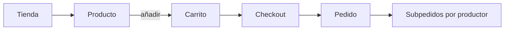
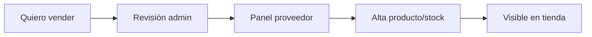

# Wireframes UI/UX — Contrato A.I (núcleo)


**Partida:** A.1 (arquitectura + diseño UI/UX)  
**Objetivo:** dejar constancia del diseño de pantallas del núcleo marketplace, alineado a la UI implementada.  
**Complemento:** [`ux.md`](./ux.md) · [`Entregables_Contrato_AI_Nucleo_Marketplace.md`](./Entregables_Contrato_AI_Nucleo_Marketplace.md)

Convención: bloques de texto = layout estructural (no mock visual pixel-perfect). Marca: *Sabores de la Culebra* · acento verde esmeralda · fondo cálido `#f7f4ee`.

---

## W1 — Home (público)

```text
┌──────────────────────────────────────────────────────────┐
│  Logo  ·  Tienda  ·  Productores  ·  Carrito  ·  Cuenta  │
├────────────────────────────┬─────────────────────────────┤
│  Del territorio a tu mesa  │  [Mosaico producto]         │
│  H1 Productos auténticos…  │  Sierra de la Culebra       │
│  CTA: Entrar en la tienda  │  Link productores           │
│  CTA: Cómo funciona        │                             │
├────────────────────────────┴─────────────────────────────┤
│  Trust strip (pago · origen · envío)                     │
├──────────────────────────────────────────────────────────┤
│  Tienda de la comarca     → Ver tienda                   │
│  [Cat1 img] [Cat2 img] [Cat3 img] [Turismo] [Packs]      │
├──────────────────────────────────────────────────────────┤
│  Destacados               → Ver productos                │
│  [Producto] [Producto] [Producto] [Producto]               │
└──────────────────────────────────────────────────────────┘
```

**Ruta:** `/`

---

## W2 — Tienda / hub de categorías

```text
┌──────────────────────────────────────────────────────────┐
│  Breadcrumb: Inicio / Tienda                             │
│  ┌─ Hero escaparate (mosaico + título) ────────────────┐ │
│  │  Escaparate de la comarca                           │ │
│  │  Tienda de la Sierra de la Culebra                  │ │
│  └─────────────────────────────────────────────────────┘ │
│  Agroalimentario                                         │
│  ┌──────────┐ ┌──────────┐ ┌──────────┐ ┌──────────┐   │
│  │  Imagen  │ │  Imagen  │ │  Imagen  │ │  Imagen  │   │
│  │  Título  │ │  Título  │ │  Título  │ │  Título  │   │
│  │  Blurb   │ │  Blurb   │ │  Blurb   │ │  Blurb   │   │
│  └──────────┘ └──────────┘ └──────────┘ └──────────┘   │
│  Territorio: [Turismo] [Packs]                           │
└──────────────────────────────────────────────────────────┘
```

**Ruta:** `/tienda`

---

## W3 — Ficha de producto

```text
┌──────────────────────┬───────────────────────────────────┐
│  [Foto producto]     │  Nombre                           │
│                      │  Productor · ubicación            │
│                      │  Precio  ·  stock                 │
│                      │  Variante (si hay)                │
│                      │  Cantidad  [+]  [Añadir carrito]  │
│                      │  Descripción                      │
└──────────────────────┴───────────────────────────────────┘
```

**Ruta:** `/productos/[slug]`

---

## W4 — Carrito unificado (desglose por productor)

```text
┌──────────────────────────────────────────────────────────┐
│  Carrito                                                 │
│  ── Productor A ────────────────────────── subtotal xx € │
│  │ producto 1   qty  [act] [quitar]                      │
│  │ producto 2   qty  [act] [quitar]                      │
│  ── Productor B ────────────────────────── subtotal yy € │
│  │ producto 3   qty  [act] [quitar]                      │
│  Cupón […]                                               │
│  Subtotal / envío (cliente) / Total                      │
│  [Ir a checkout]                                         │
└──────────────────────────────────────────────────────────┘
```

**Ruta:** `/carrito` · evidencia A.3

---

## W5 — Checkout

```text
┌────────────────────────────┬─────────────────────────────┐
│  Datos envío / contacto    │  Resumen pedido             │
│  Nombre, email, dirección  │  Líneas (+ productor)       │
│  Teléfono                  │  Envío tarifa plana         │
│  [Confirmar pedido]        │  Total                      │
└────────────────────────────┴─────────────────────────────┘
```

**Ruta:** `/checkout`  
*Pago Stripe / retención = A.II (A.4); aquí el flujo de compra hasta pedido.*

---

## W6 — Seguimiento de pedido (por productor)

```text
┌──────────────────────────────────────────────────────────┐
│  Pedido #XXXX                                            │
│  Estado global                                           │
│  Seguimiento por productor                               │
│  ┌ Productor A ─ estado ─ líneas ─ tracking ──────────┐ │
│  └────────────────────────────────────────────────────┘ │
│  ┌ Productor B ─ estado ─ líneas ─ tracking ──────────┐ │
│  └────────────────────────────────────────────────────┘ │
└──────────────────────────────────────────────────────────┘
```

**Ruta:** `/pedido/[orderNumber]`

---

## W7 — Panel del proveedor

```text
┌──────────────────────────────────────────────────────────┐
│  Logo · Panel proveedor                                  │
│  Nav: Inicio | Productos | Pedidos | Pagos | Contratos   │
├──────────────────────────────────────────────────────────┤
│  Resumen tienda (estado, alta Stripe si aplica)          │
│  Acciones: nuevo producto · ver pedidos                  │
│  Lista productos: nombre · precio · stock · estado       │
└──────────────────────────────────────────────────────────┘
```

**Rutas:** `/panel/proveedor` · `/panel/proveedor/productos` · evidencia A.2

---

## W8 — Panel admin (núcleo)

```text
┌──────────────────────────────────────────────────────────┐
│  Logo · Panel · tienda comarca · Resumen                 │
│  Nav chips: Productores | Productos | Pedidos | Plan…    │
├──────────────────────────────────────────────────────────┤
│  Hero escaparate + CTA “Abrir tienda pública”            │
│  Tarjetas métrica (foto categoría + contador)            │
│  → Productores pendientes / Productos / Pedidos / …      │
└──────────────────────────────────────────────────────────┘
```

**Ruta:** `/admin` · detalle comisión en `/admin/productores/[id]` · evidencia A.5a

---

## Flujo usuario (A.1 + A.3)



## Flujo productor (A.2)



---

## Registro de versión

| Fecha | Cambio |
|-------|--------|
| 2026-08 | Primera versión formal de wireframes A.I alineada a UI en producción/desarrollo |
